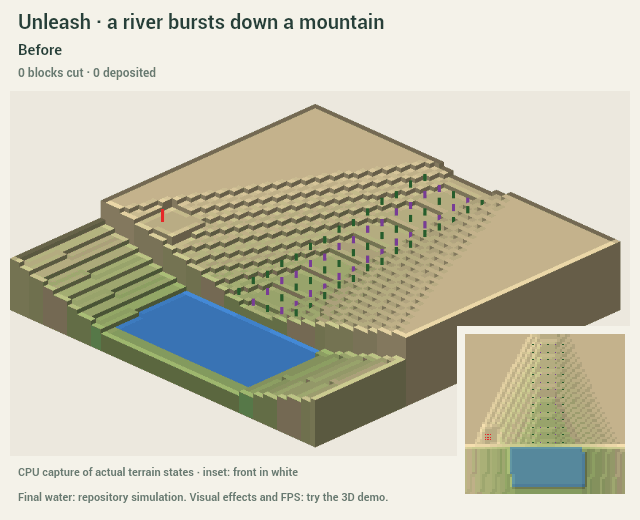
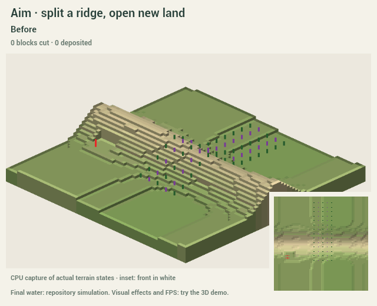
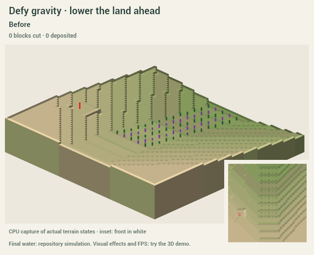
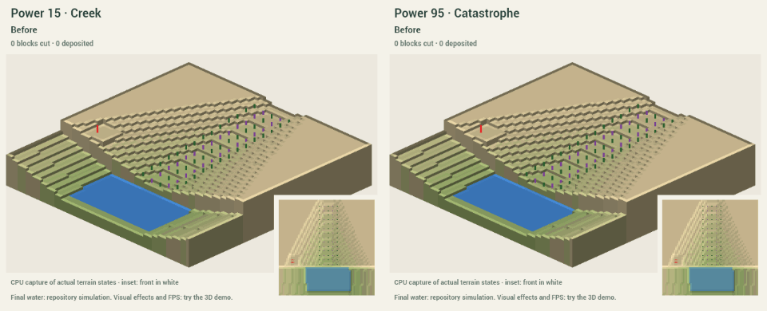
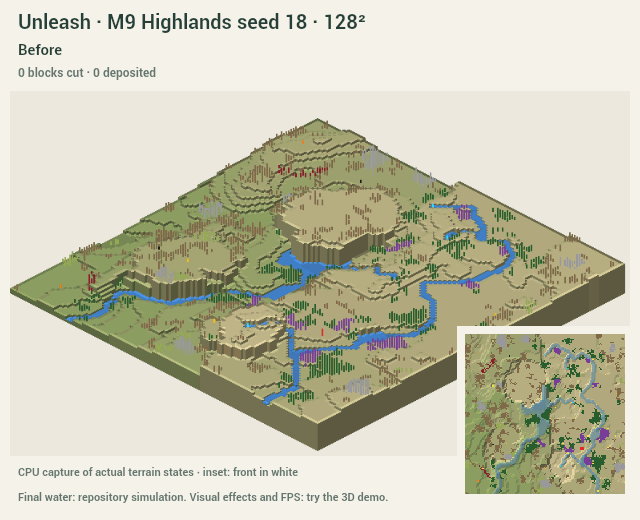

# Let the water carve

The demo is rebuilt around a moving, forceful river. Run from the repo root:

    npm --prefix investigation/carve run demo

Open the printed local URL (normally http://127.0.0.1:5198/).
**Unleash:** click an origin. **Aim:** click origin, then destination.
Turn on **Defy gravity** for an uphill destination. Power sets resistance,
width, depth and travel budget. Steep keeps a gorge; Wide opens terraces.
Keep river is the default; Dry canyon omits the new source. Later carves keep
earlier river sources unless their ground is carved away.

Pause and speed change playback. Stop keeps everything carved so far.
**Esc or Undo cancels the entire carve immediately**, even during water
settling. Finished runs undo in one step. Save run / Replay run preserve the
literal result, including the source, removed objects and final water.

The map selector includes actual M9 seeds at 128² and 256² and three Real
places. The initial mountain and the ridge/uphill maps are labeled process
studies. The view now uses the editor's actual clean terrain, water and object
shaders, soil colours, shadows, models and waterfall curtains. Three.js remains
exactly 0.186.0.

## What changed

A momentum-driven head cuts from the source, with a narrow muddy ribbon,
whitewater and a fixed pool of breaking chunks/dust. The floor deepens behind
it; Wide lets the sides retreat into terraces. Map-derived horizontal hard
beds delay cuts and retain benches. A carried debris budget builds a fan or
delta at the receiving end. Follow the river gently tracks the head and gives
breakthroughs/falls a little more screen time. Reduced motion disables these
effects and camera motion.

The prototype intentionally exaggerates nature. Its force chooses and cuts
the route; Timberborn's water does not erode. Once the force ends, the repo's
canonical simulation decides where the retained source flows. **An endpoint
in a closed basin can fill the gorge into a lake.** Dry canyon exposes the
landform without adding a source; existing sources still obey the game.

The start and its supporting ground are fixed. Other objects whose footprints
lose ground disappear. The editor's live start checks and reachable-land
overlay update during carving; missing water, wood or berries never veto it.

## Captures

These are small animated CPU captures of actual step states, not mockups or
GPU recordings. The white inset ring locates the front. The last frame uses
the game's canonical water; the browser demonstrates the clean look and VFX.
[Settings and exact step counts](captures/scenarios.json).
Each GIF also has a same-name PNG contact sheet for reduced motion.

## Verification and decisions

    npm --prefix investigation/carve test
    npm --prefix investigation/carve run typecheck
    npm --prefix investigation/carve run build
    npm --prefix investigation/carve run captures

[Model checks](captures/checks.json) and [actual worker checks](captures/worker-checks.json)
cover visible local progress, power, ridge breakthrough, uphill grading,
layers, terraces, integer/monotone terrain, no new isolated spikes/pits,
object removal, protected start, canonical water and exact JSON replay.
Browser verification covered the clean view, source click, complete carve,
whole-run undo, cancel and the new controls.

One displayed second is ten acknowledged steps. Wall-clock time, playback
speed and effects do not change a result. Each tile keeps its direction for
the run; new deposits cannot be recut until a later run. Geology is a coherent
layer stack derived from a terrain hash, unless the map supplies layers.
Sediment is a lumped carried load, not a grain-level fluid simulation. Unused
load stays diagnostic; it is exported only at a map edge.

Meshing, checks, generation and water run in a worker. Uploads are limited to
two chunks and a 3 ms scheduling budget per frame. A chunk upload, water tick
or model step remains indivisible; this is not a GPU-time guarantee.
**Judge 256² frame rate on your PC with the on-screen FPS/p95 readout.**
Painting latency still needs validation in the real Live editor after adoption;
this standalone prototype has no painting tool.

All changes stay under investigation/carve. The branch remains based on dev.
M9 v2 c77026b was read from investigation/generative-v2, without merging it.
Adoption and changes after PR #32 are proposals in [INTEGRATION.md](INTEGRATION.md).
