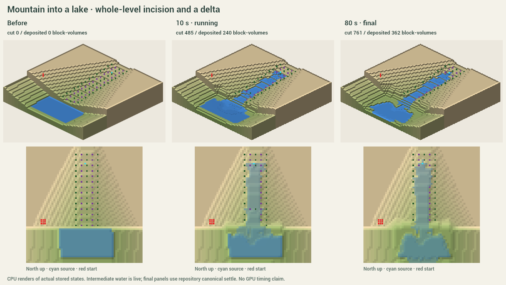
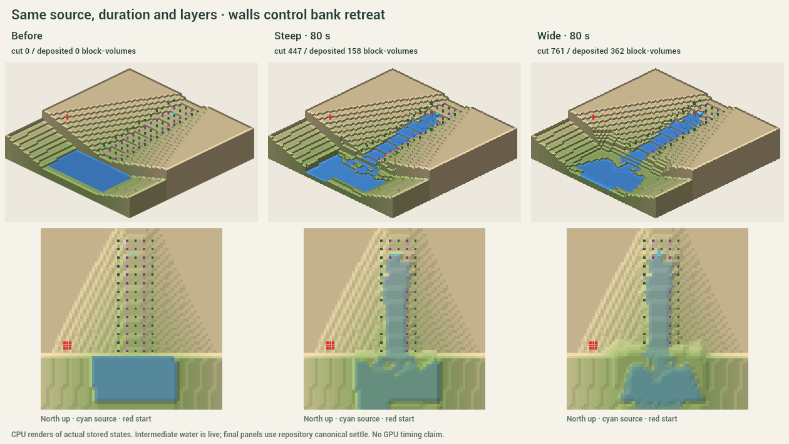
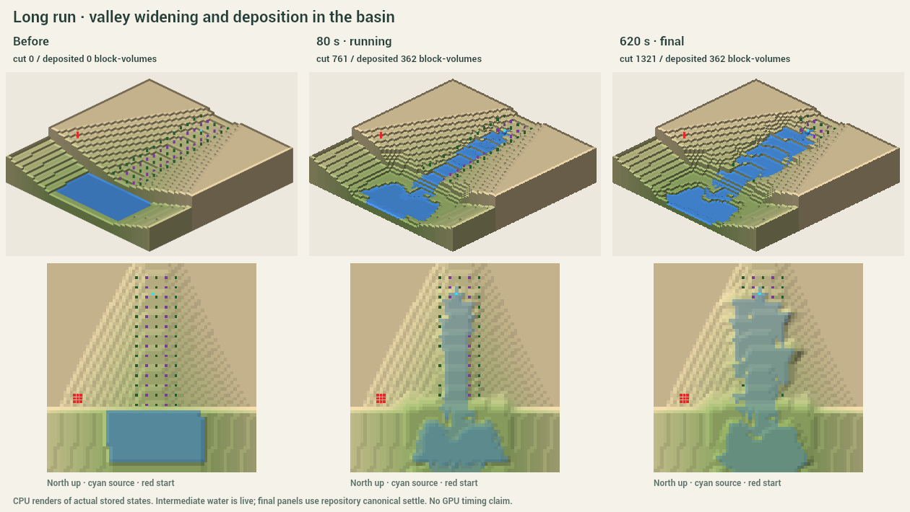
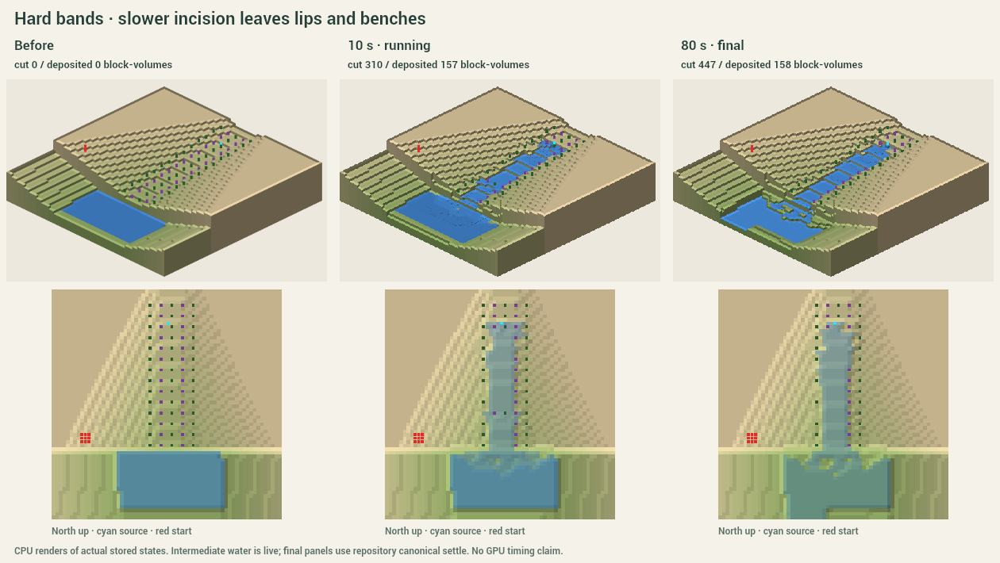
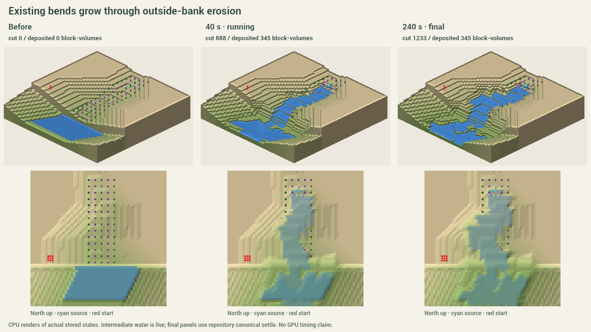
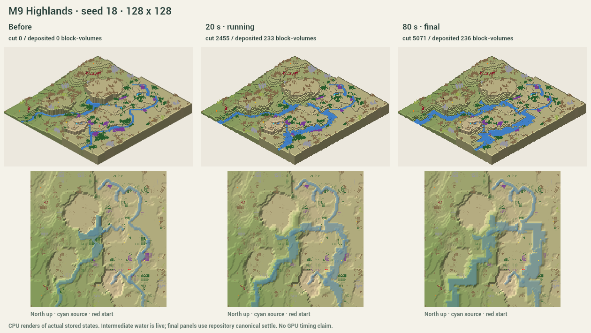
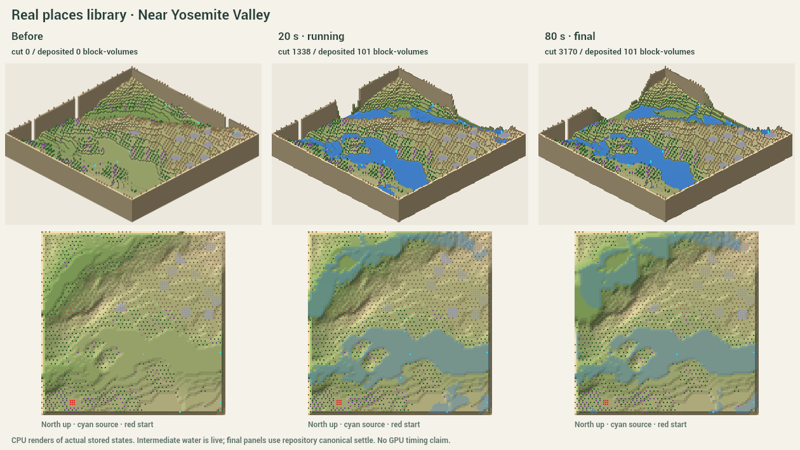

# Let the water carve

Run from the repository root (Node 22+):

    npm --prefix investigation/carve run demo

Open http://127.0.0.1:5198/. First use installs this folder's locked dependencies.
Pick a map, click a hillside, then **Let water carve**. Choose **Wide** or **Steep**.
Pause, change playback speed, or Stop. Under **Options**, set flow, rock layers
and an exact duration; zero means run until stable. **Save run** and **Replay
saved run** preserve a result across reloads. Undo restores a whole run at once.

The demo loads M9 generated seeds at 128² and 256² and three existing Real places.
The two labeled studies are controlled test terrain, not generated or real maps.
The view uses the repo's terrain/water meshers, object models and clean palette,
with simpler lighting. Three.js is exactly 0.186.0, the repository's locked version.

## What works

- Live water flux drives stream-power incision. Water falls over ledges and fills hollows.
- Banks slump toward the channel. Wide makes gentler terraces; steep preserves gorges.
- Eroded material travels downstream and settles in slow, deep water. The budget
  accounts for cut, deposited, suspended and exported sediment.
- Incoming momentum attacks the outside of existing bends. Horizontal hard beds
  slow incision and slumping, preserving lips and benches.
- The effect spreads from the placed source. Terrain remains in whole levels.
  A tile never reverses direction within a run; no new isolated pits or spikes.
- The start and its supporting margin stay fixed. Washed-away plants disappear.
- The worker stops on sustained terrain and water stability, or on Stop/duration.
  It then uses the repo's canonical water solve. A non-converged solve is labeled.
- One result operation stores terrain, entities and both water states.
  Undo, redo and portable replay never rerun erosion.

## Evidence

Run the checks and regenerate captures:

    npm --prefix investigation/carve test
    npm --prefix investigation/carve run typecheck
    npm --prefix investigation/carve run build
    npm --prefix investigation/carve run captures

[CPU and invariant checks](captures/checks.json) cover determinism, every-step
monotonicity, sediment conservation, start protection, removed plants, terrain
integrity, local progression, auto-stop, real maps and exact canonical water.
[Worker checks](captures/worker-checks.json) exercise the actual message handler,
pause, stop, transferred geometry, complete history and portable replay.
Browser checks covered source placement, a timed 8-second run and whole-run undo.

The final CPU run measured 14.7 ms p95 per early erosion step at 256² and 3.3 ms
for applying and undoing its stored data. CPU times are machine/load dependent. Geometry is built off-thread and uploaded
at most two chunks per frame. The readout shows rendered fps and p95 frame time.
**256² GPU performance and painting responsiveness need your PC's acceptance;
this standalone page has no painting tool.** No game was launched.

## Captures

These small CPU contact sheets show actual states, not mockups. Each panel has
an isometric and top-down view. Intermediate water is live; final water uses
the repository solve. The regular terrain in the first studies is intentional,
so the process can be compared. [Settings and counts](captures/scenarios.json).

## Decisions and limits

This is an accelerated landscape model, not a calibrated geological forecast.
One displayed second is ten erosion steps, each with four game-water ticks.
Speed changes presentation only. Exact duration is the stored step count.

No-flicker direction locks deliberately prevent a river from recutting its new
deposits in the same run. Meanders enlarge existing bends; this is not a full
oxbow or freely migrating alluvial-river model. Deposition builds submerged
shelves and delta platforms; broad exposed floodplain ecology is not modeled.
Intermediate terrain updates displace/remove water locally; the final canonical
solve replaces that history-dependent preview.

Stable means 240 steps without a terrain change and small depth movement at a
40-step check. The long study stops at step 6,200; slow sub-level work is not
treated as visible landscape change. The canonical solver retains its own
four-day cap. All captured final solves converged.

Glacier carving is deferred. The core needs visual/performance acceptance before
adding another process. Adoption remains a proposal in [INTEGRATION.md](INTEGRATION.md).

Branch base: dev at 5bc0e79. M9 v2 at c77026b was read from its own branch only;
nothing from that branch was merged. Existing staged work stayed untouched in
the user's checkout. Only investigation/carve changes; shared docs and contact
sheet locations in CLAUDE.md were deliberately not edited under the task's scope rule.

[Model and sources](MODEL.md) · [Real places credits](ATTRIBUTION.md)
