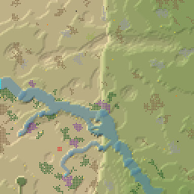
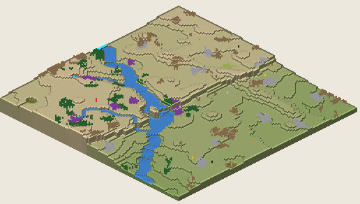

# 1. Proto River Valley 18

River Valley, 128², Normal, seed 18, prototype 0.7.0-proto.2. File:
[out/Proto River Valley 18.timber](../out/Proto%20River%20Valley%2018.timber).

 

## Terrain

- **Land:** trough, ridge, escarpment over land falling toward the east; 9 levels of relief, 61% flat, 7 plateaus.
- **Water:** 3 rivers (1 from the map edge, 2 from springs), 3 lakes, 3 falls (tallest 3.76 levels), a river island; water covers 8% of the map.
- **Start:** bench; **badwater:** a hollow on high ground; **recipe:** great-scarp.

## How it plays

- You start by a river, 4 tiles away on your own level.
- In a drought it runs dry within a day: store water early.
- A 5-tile dam 26 tiles north-east holds a drought's water.
- Badwater lies 31 tiles south-west.
- Expand to the west and south, on wide, level land.
- Further out: mine sites, a geothermal field, relics and most of the ruins.

## Cycle timeline

From the weather-cycle simulator of `investigation/cycles` (PR #10, read only), weather seed 1729,
before anything is built:

| Weather | At its end | The start's pumpable water | Afterwards |
|---|---|---|---|
| First drought, Normal (3 days) | 20% of the water left | loses it by day 1 | back within a day |
| Later drought, Hard (26 days) | 0% of the water left | loses it by day 1 | back within a day |
| First badtide, Normal (2 days) | 1,279 tiles of badwater | loses it by day 1 | back within a day |

## Strategy axes

From the mechanics study of `investigation/mechanics` (PR #9, read only): its eight axes, each in
its own fixed bins (bin 0 is the lowest).

| Axis | Value | Bin |
|---|---|---|
| Storage work | 0.07 × the drought need kept by the land within 40 tiles | 0 of 3 |
| Power location | 0.91 blocks/s at the best clean flow beside reachable land | 1 of 3 |
| Land and height | 1448 dry tiles on the start's level within 40 tiles' walk | 3 of 3 |
| Fertile land | 0% of the moist land near the start still moist after the drought | 0 of 2 |
| Threat exposure | 28.9 tiles to the nearest badwater or contaminated soil | 1 of 3 |
| Resource timing | 127 logs standing within 20 tiles' walk | 1 of 3 |
| Expansion choice | 2 separate regions to expand into beyond 20 tiles | 1 of 2 |
| Faction opportunity | 11 extra shore tiles a deep pump reaches | 2 of 3 |
