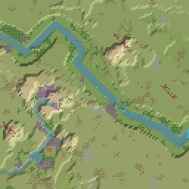
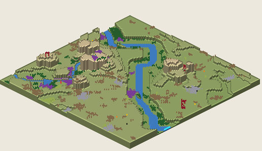

# 2. Proto Canyon 8

Canyon, 128², Normal, seed 8, prototype 0.7.0-proto.2. File:
[out/Proto Canyon 8.timber](../out/Proto%20Canyon%208.timber).

 

## Terrain

- **Land:** mesaField, trough, escarpment over land falling toward the south-west; 10 levels of relief, 66% flat, 7 plateaus.
- **Water:** 2 rivers (1 from the map edge, 1 from springs), 0 lakes, 0 falls (tallest 0.99 levels); water covers 7% of the map.
- **Start:** lake; **badwater:** none; **recipe:** mesa-field.

## How it plays

- You start by a lake, 5 tiles away on your own level.
- In a Normal drought it shrinks; in a Hard drought it lasts 11 days.
- A 7-tile dam 34 tiles south-west holds a drought's water.
- Thorns bar the way north-west, 28 tiles out.
- Expand to the west and south, on narrow ledges.
- Further out: mine sites, a geothermal field, relics, another lake or river and most of the ruins.

## Cycle timeline

From the weather-cycle simulator of `investigation/cycles` (PR #10, read only), weather seed 1729,
before anything is built:

| Weather | At its end | The start's pumpable water | Afterwards |
|---|---|---|---|
| First drought, Normal (3 days) | 7% of the water left | keeps it throughout | back within a day |
| Later drought, Hard (26 days) | 0% of the water left | loses it by day 11 | back within a day |
| First badtide, Normal (2 days) | 1,151 tiles of badwater | keeps it throughout | back in 4 days |

## Strategy axes

From the mechanics study of `investigation/mechanics` (PR #9, read only): its eight axes, each in
its own fixed bins (bin 0 is the lowest).

| Axis | Value | Bin |
|---|---|---|
| Storage work | 0.11 × the drought need kept by the land within 40 tiles | 0 of 3 |
| Power location | 0.3 blocks/s at the best clean flow beside reachable land | 0 of 3 |
| Land and height | 339 dry tiles on the start's level within 40 tiles' walk | 1 of 3 |
| Fertile land | 78% of the moist land near the start still moist after the drought | 2 of 2 |
| Threat exposure | none found | – |
| Resource timing | 114 logs standing within 20 tiles' walk | 1 of 3 |
| Expansion choice | 2 separate regions to expand into beyond 20 tiles | 1 of 2 |
| Faction opportunity | 0 extra shore tiles a deep pump reaches | 0 of 3 |
