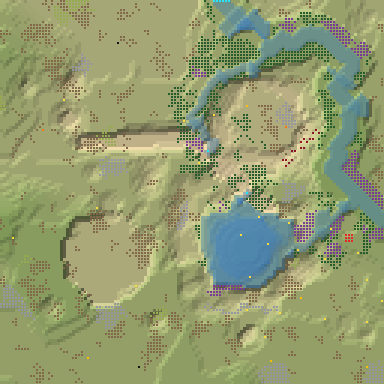
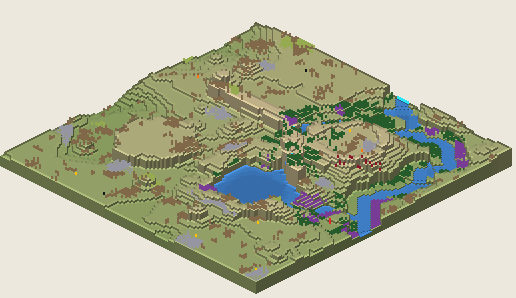

# 3. Proto Highlands 30

Highlands, 128², Normal, seed 30, prototype 0.7.0-proto.2. File:
[out/Proto Highlands 30.timber](../out/Proto%20Highlands%2030.timber).

 

## Terrain

- **Land:** basin, plateau, caldera, ridge over land falling toward the south; 10 levels of relief, 46% flat, 2 plateaus.
- **Water:** 3 rivers (1 from the map edge, 2 from springs), 1 lake, 2 falls (tallest 2.02 levels); water covers 10% of the map.
- **Start:** confluence; **badwater:** none.

## How it plays

- You start by a lake, 9 tiles away on your own level.
- In a Normal drought it keeps most of its water; in a Hard drought it lasts 4 days.
- An 8-tile dam 10 tiles north holds a drought's water.
- Thorns bar the way north-west, 33 tiles out.
- Expand to the south-west and south, on narrow ledges.
- Further out: mine sites, a geothermal field, relics, waterfalls and most of the ruins.

## Cycle timeline

From the weather-cycle simulator of `investigation/cycles` (PR #10, read only), weather seed 1729,
before anything is built:

| Weather | At its end | The start's pumpable water | Afterwards |
|---|---|---|---|
| First drought, Normal (3 days) | 75% of the water left | keeps it throughout | back within a day |
| Later drought, Hard (26 days) | 39% of the water left | loses it by day 4 | back in 4 days |
| First badtide, Normal (2 days) | 1,083 tiles of badwater | loses it by day 2 | not back within 5 days |

## Strategy axes

From the mechanics study of `investigation/mechanics` (PR #9, read only): its eight axes, each in
its own fixed bins (bin 0 is the lowest).

| Axis | Value | Bin |
|---|---|---|
| Storage work | 4.6 × the drought need kept by the land within 40 tiles | 3 of 3 |
| Power location | 0.24 blocks/s at the best clean flow beside reachable land | 0 of 3 |
| Land and height | 139 dry tiles on the start's level within 40 tiles' walk | 0 of 3 |
| Fertile land | 0% of the moist land near the start still moist after the drought | 0 of 2 |
| Threat exposure | none found | – |
| Resource timing | 39 logs standing within 20 tiles' walk | 0 of 3 |
| Expansion choice | 1 separate regions to expand into beyond 20 tiles | 0 of 2 |
| Faction opportunity | 0 extra shore tiles a deep pump reaches | 0 of 3 |
