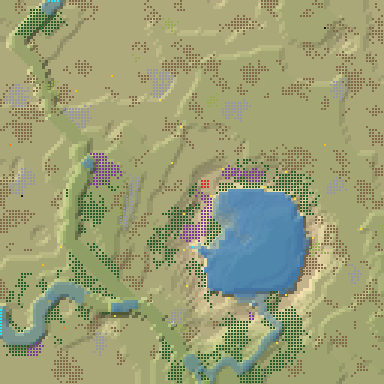
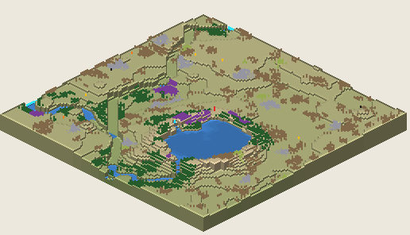

# 4. Proto Lake Basin 25

Lake Basin, 128², Normal, seed 25, prototype 0.7.0-proto.2. File:
[out/Proto Lake Basin 25.timber](../out/Proto%20Lake%20Basin%2025.timber).

 

## Terrain

- **Land:** cone, basin, caldera over a bowl draining toward the south; 7 levels of relief, 58% flat, 7 plateaus.
- **Water:** 3 rivers (2 from the map edge, 1 from springs), 1 lake, 2 falls (tallest 2.04 levels); water covers 8% of the map.
- **Start:** lake; **badwater:** none; **recipe:** caldera.

## How it plays

- You start by a lake, 4 tiles away on your own level.
- In a Normal drought it keeps most of its water; in a Hard drought it lasts 2 days.
- A 1-tile dam 18 tiles east holds a drought's water.
- Expand to the east and south, on narrow ledges across 5 levels.
- Further out: mine sites, a geothermal field, relics, another lake or river and most of the ruins.

## Cycle timeline

From the weather-cycle simulator of `investigation/cycles` (PR #10, read only), weather seed 1729,
before anything is built:

| Weather | At its end | The start's pumpable water | Afterwards |
|---|---|---|---|
| First drought, Normal (3 days) | 95% of the water left | loses it by day 2 | not back within 5 days |
| Later drought, Hard (26 days) | 76% of the water left | loses it by day 2 | not back within 5 days |
| First badtide, Normal (2 days) | 456 tiles of badwater | keeps it throughout | not back within 5 days |

## Strategy axes

From the mechanics study of `investigation/mechanics` (PR #9, read only): its eight axes, each in
its own fixed bins (bin 0 is the lowest).

| Axis | Value | Bin |
|---|---|---|
| Storage work | 26.86 × the drought need kept by the land within 40 tiles | 3 of 3 |
| Power location | 0.17 blocks/s at the best clean flow beside reachable land | 0 of 3 |
| Land and height | 138 dry tiles on the start's level within 40 tiles' walk | 0 of 3 |
| Fertile land | 31% of the moist land near the start still moist after the drought | 1 of 2 |
| Threat exposure | none found | – |
| Resource timing | 128 logs standing within 20 tiles' walk | 1 of 3 |
| Expansion choice | 4 separate regions to expand into beyond 20 tiles | 2 of 2 |
| Faction opportunity | 4 extra shore tiles a deep pump reaches | 1 of 3 |
