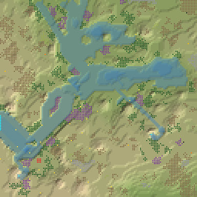
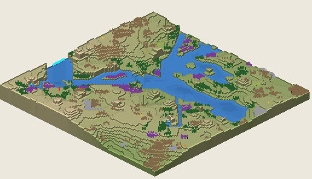

# 5. Proto Delta 12

Delta, 128², Normal, seed 12, prototype 0.7.0-proto.2. File:
[out/Proto Delta 12.timber](../out/Proto%20Delta%2012.timber).

 

## Terrain

- **Land:** rolling ground over land falling toward the north-east; 9 levels of relief, 39% flat, 2 plateaus.
- **Water:** 3 rivers (1 from the map edge, 2 from springs), 2 lakes, 0 falls (tallest 1.12 levels), a river island, a delta; water covers 17% of the map.
- **Start:** falls; **badwater:** none.

## How it plays

- You start by a lake, 7 tiles away on your own level.
- In a Normal drought it shrinks; in a Hard drought it lasts 6 days.
- There is no easy dam near the start: build levees or dig a reservoir.
- Expand to the east and north-east, on narrow ledges.
- Further out: mine sites, a geothermal field, relics and most of the ruins.

## Cycle timeline

From the weather-cycle simulator of `investigation/cycles` (PR #10, read only), weather seed 1729,
before anything is built:

| Weather | At its end | The start's pumpable water | Afterwards |
|---|---|---|---|
| First drought, Normal (3 days) | 61% of the water left | keeps it throughout | back within a day |
| Later drought, Hard (26 days) | 6% of the water left | loses it by day 6 | back in 2 days |
| First badtide, Normal (2 days) | 2,813 tiles of badwater | loses it by day 1 | not back within 5 days |

## Strategy axes

From the mechanics study of `investigation/mechanics` (PR #9, read only): its eight axes, each in
its own fixed bins (bin 0 is the lowest).

| Axis | Value | Bin |
|---|---|---|
| Storage work | 0.63 × the drought need kept by the land within 40 tiles | 1 of 3 |
| Power location | 0.48 blocks/s at the best clean flow beside reachable land | 0 of 3 |
| Land and height | 300 dry tiles on the start's level within 40 tiles' walk | 1 of 3 |
| Fertile land | 1% of the moist land near the start still moist after the drought | 0 of 2 |
| Threat exposure | none found | – |
| Resource timing | 249 logs standing within 20 tiles' walk | 2 of 3 |
| Expansion choice | 1 separate regions to expand into beyond 20 tiles | 0 of 2 |
| Faction opportunity | 0 extra shore tiles a deep pump reaches | 0 of 3 |
