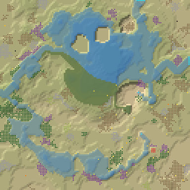
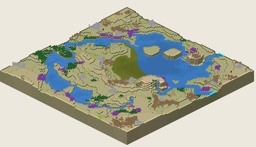

# 6. Proto Islands 29

Islands, 128², Normal, seed 29, prototype 0.7.0-proto.2. File:
[out/Proto Islands 29.timber](../out/Proto%20Islands%2029.timber).

 

## Terrain

- **Land:** basin, cone, mesa over a bowl draining toward the west; 8 levels of relief, 38% flat, 11 plateaus.
- **Water:** 4 rivers (2 from the map edge, 2 from springs), 2 lakes, 1 fall (tallest 4 levels); water covers 29% of the map.
- **Start:** stream; **badwater:** a hollow on high ground.

## How it plays

- You start by a lake, 3 tiles away on your own level.
- In a Normal drought it shrinks; in a Hard drought it lasts 2 days.
- A 6-tile dam 30 tiles south-west holds a drought's water.
- Badwater lies 32 tiles north-west, and some drains into your lake.
- Expand on every side, on some level land across 5 levels.
- Further out: mine sites, a geothermal field, relics, waterfalls and most of the ruins.

## Cycle timeline

From the weather-cycle simulator of `investigation/cycles` (PR #10, read only), weather seed 1729,
before anything is built:

| Weather | At its end | The start's pumpable water | Afterwards |
|---|---|---|---|
| First drought, Normal (3 days) | 59% of the water left | loses it by day 2 | back in 2 days |
| Later drought, Hard (26 days) | 29% of the water left | loses it by day 2 | back in 3 days |
| First badtide, Normal (2 days) | 3,963 tiles of badwater | loses it by day 1 | back in 4 days |

## Strategy axes

From the mechanics study of `investigation/mechanics` (PR #9, read only): its eight axes, each in
its own fixed bins (bin 0 is the lowest).

| Axis | Value | Bin |
|---|---|---|
| Storage work | 0.07 × the drought need kept by the land within 40 tiles | 0 of 3 |
| Power location | 0.67 blocks/s at the best clean flow beside reachable land | 1 of 3 |
| Land and height | 204 dry tiles on the start's level within 40 tiles' walk | 1 of 3 |
| Fertile land | 0% of the moist land near the start still moist after the drought | 0 of 2 |
| Threat exposure | 32 tiles to the nearest badwater or contaminated soil | 2 of 3 |
| Resource timing | 196 logs standing within 20 tiles' walk | 2 of 3 |
| Expansion choice | 4 separate regions to expand into beyond 20 tiles | 2 of 2 |
| Faction opportunity | 0 extra shore tiles a deep pump reaches | 0 of 3 |
