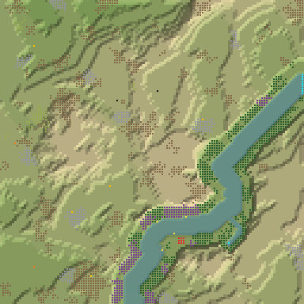
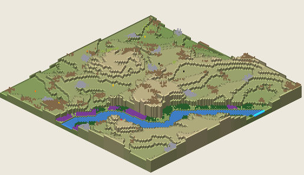

# 7. Proto Canyon 30

Canyon, 128², Normal, seed 30, prototype 0.7.0-proto.2. File:
[out/Proto Canyon 30.timber](../out/Proto%20Canyon%2030.timber).

 

## Terrain

- **Land:** ridge, mesaField, plateau over land falling toward the west; 11 levels of relief, 52% flat, 7 plateaus.
- **Water:** 2 rivers (1 from the map edge, 1 from springs), 1 lake, 0 falls (tallest 0.08 levels); water covers 7% of the map.
- **Start:** river; **badwater:** none.

## How it plays

- You start by a river, 2 tiles away on your own level.
- In a drought it runs dry within a day: store water early.
- There is no easy dam near the start: build levees or dig a reservoir.
- Expand to the east, north and west, on narrow ledges.
- Further out: mine sites, a geothermal field, relics and most of the ruins.

## Cycle timeline

From the weather-cycle simulator of `investigation/cycles` (PR #10, read only), weather seed 1729,
before anything is built:

| Weather | At its end | The start's pumpable water | Afterwards |
|---|---|---|---|
| First drought, Normal (3 days) | 0% of the water left | loses it by day 1 | back within a day |
| Later drought, Hard (26 days) | 0% of the water left | loses it by day 1 | back within a day |
| First badtide, Normal (2 days) | 1,106 tiles of badwater | loses it by day 1 | back within a day |

## Strategy axes

From the mechanics study of `investigation/mechanics` (PR #9, read only): its eight axes, each in
its own fixed bins (bin 0 is the lowest).

| Axis | Value | Bin |
|---|---|---|
| Storage work | 0 × the drought need kept by the land within 40 tiles | 0 of 3 |
| Power location | 1.23 blocks/s at the best clean flow beside reachable land | 2 of 3 |
| Land and height | 386 dry tiles on the start's level within 40 tiles' walk | 1 of 3 |
| Fertile land | 0% of the moist land near the start still moist after the drought | 0 of 2 |
| Threat exposure | none found | – |
| Resource timing | 248 logs standing within 20 tiles' walk | 2 of 3 |
| Expansion choice | 3 separate regions to expand into beyond 20 tiles | 1 of 2 |
| Faction opportunity | 0 extra shore tiles a deep pump reaches | 0 of 3 |
