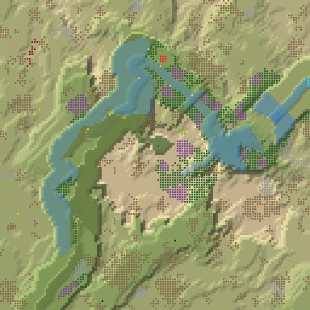
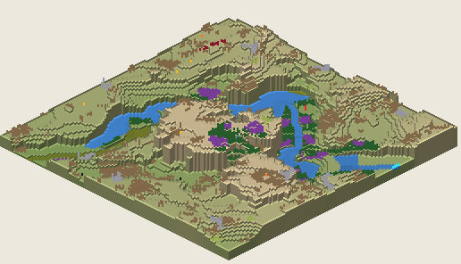

# 8. Proto Canyon 5

Canyon, 128², Normal, seed 5, prototype 0.7.0-proto.2. File:
[out/Proto Canyon 5.timber](../out/Proto%20Canyon%205.timber).

 

## Terrain

- **Land:** trough, plateau, ridge over land falling toward the south-west; 14 levels of relief, 38% flat, 9 plateaus.
- **Water:** 2 rivers (1 from the map edge, 1 from springs), 3 lakes, 3 falls (tallest 3.94 levels); water covers 13% of the map.
- **Start:** river; **badwater:** a hollow on high ground.

## How it plays

- You start by a stream, 7 tiles away on your own level.
- In a Normal drought it shrinks; in a Hard drought it is gone within a day.
- An 11-tile dam 12 tiles south holds a drought's water.
- Badwater lies 7 tiles north-west, and some drains into your stream.
- Expand to the south-west, south and south-east, on narrow ledges.
- Further out: mine sites, a geothermal field, relics, another lake or river, waterfalls and most of the ruins.

## Cycle timeline

From the weather-cycle simulator of `investigation/cycles` (PR #10, read only), weather seed 1729,
before anything is built:

| Weather | At its end | The start's pumpable water | Afterwards |
|---|---|---|---|
| First drought, Normal (3 days) | 59% of the water left | loses it by day 1 | back within a day |
| Later drought, Hard (26 days) | 3% of the water left | loses it by day 1 | back in 2 days |
| First badtide, Normal (2 days) | 2,382 tiles of badwater | loses it by day 1 | back in 3 days |

## Strategy axes

From the mechanics study of `investigation/mechanics` (PR #9, read only): its eight axes, each in
its own fixed bins (bin 0 is the lowest).

| Axis | Value | Bin |
|---|---|---|
| Storage work | 0.29 × the drought need kept by the land within 40 tiles | 1 of 3 |
| Power location | 0.56 blocks/s at the best clean flow beside reachable land | 1 of 3 |
| Land and height | 171 dry tiles on the start's level within 40 tiles' walk | 1 of 3 |
| Fertile land | 60% of the moist land near the start still moist after the drought | 1 of 2 |
| Threat exposure | 6.7 tiles to the nearest badwater or contaminated soil | 0 of 3 |
| Resource timing | 182 logs standing within 20 tiles' walk | 2 of 3 |
| Expansion choice | 0 separate regions to expand into beyond 20 tiles | 0 of 2 |
| Faction opportunity | 0 extra shore tiles a deep pump reaches | 0 of 3 |
