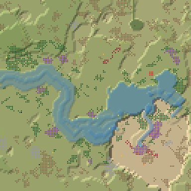
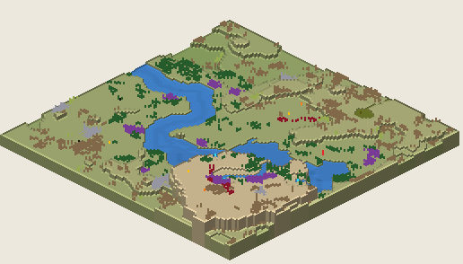

# 10. Proto Highlands 29

Highlands, 128², Normal, seed 29, prototype 0.7.0-proto.2. File:
[out/Proto Highlands 29.timber](../out/Proto%20Highlands%2029.timber).

 

## Terrain

- **Land:** basin, plateau over land falling toward the west; 10 levels of relief, 69% flat, 3 plateaus.
- **Water:** 3 rivers (0 from the map edge, 3 from springs), 1 lake, 3 falls (tallest 7.07 levels), a river island; water covers 14% of the map.
- **Start:** falls; **badwater:** a hollow on high ground.

## How it plays

- You start by a lake, right beside you.
- In a drought it runs dry, after 2 days in a Hard one: store water early.
- An 8-tile dam 13 tiles south-west holds a drought's water.
- Thorns bar the way north-west, 27 tiles out.
- Expand to the north and west, on some level land.
- Further out: mine sites, a geothermal field, relics, waterfalls and most of the ruins.

## Cycle timeline

From the weather-cycle simulator of `investigation/cycles` (PR #10, read only), weather seed 1729,
before anything is built:

| Weather | At its end | The start's pumpable water | Afterwards |
|---|---|---|---|
| First drought, Normal (3 days) | 15% of the water left | loses it by day 2 | back in 2 days |
| Later drought, Hard (26 days) | 1% of the water left | loses it by day 2 | back in 2 days |
| First badtide, Normal (2 days) | 2,410 tiles of badwater | keeps it throughout | back in 5 days |

## Strategy axes

From the mechanics study of `investigation/mechanics` (PR #9, read only): its eight axes, each in
its own fixed bins (bin 0 is the lowest).

| Axis | Value | Bin |
|---|---|---|
| Storage work | 0.24 × the drought need kept by the land within 40 tiles | 0 of 3 |
| Power location | 0.76 blocks/s at the best clean flow beside reachable land | 1 of 3 |
| Land and height | 1464 dry tiles on the start's level within 40 tiles' walk | 3 of 3 |
| Fertile land | 0% of the moist land near the start still moist after the drought | 0 of 2 |
| Threat exposure | 23.5 tiles to the nearest badwater or contaminated soil | 1 of 3 |
| Resource timing | 139 logs standing within 20 tiles' walk | 1 of 3 |
| Expansion choice | 2 separate regions to expand into beyond 20 tiles | 1 of 2 |
| Faction opportunity | 0 extra shore tiles a deep pump reaches | 0 of 3 |
