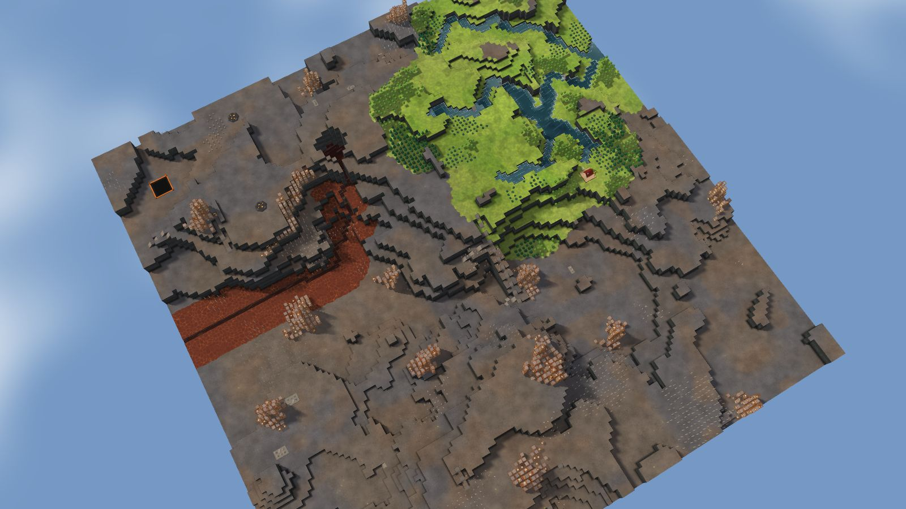
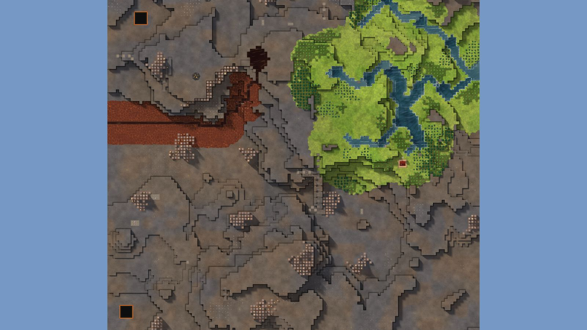

# 1. Mesa Crown

Highlands, 128², designed for Normal, seed 50, Verticality 47 (the theme's default). Prototype 0.7.0-proto2.1.
File: [out/v2/Mesa Crown (Highlands 50).timber](../../out/v2/Mesa%20Crown%20(Highlands%2050).timber).

*Rendered with the app's 3D view, in the clean look.*

## Intention

- The start sits under a cliff, with water below (Kyler's own). **Emerged** (21 tiles 2+ levels above within 7, cliff yes, water 1 tiles' walk).

## How it plays

- You start by a lake, right beside you.
- It lasts through the first drought; in a 26-day Hard drought it is gone by day 6.
- No short dam holds a drought's water near the start: build levees or dig a reservoir.
- Badwater lies 59 tiles north-west.
- 186 logs of wood within 20 tiles' walk, mostly pine and birch: little wood a tree, quick to regrow; plus about 90 logs growing.
- You start under a cliff, with your water below.
- Expand to the east and north, on some level land.
- Most of the high ground needs stairs.
- Further out: mine sites, a geothermal field, relics, another lake or river, waterfalls and most of the ruins.

## Terrain

- **Land:** mesa, plateau, escarpment, basin over land with no one regional slope; recipe: hanging-lake.
- **Relief:** 12 levels (p5–p95), 14 levels in use, highest 16; 22% cliff, 56% flat; tallest fall 2.99 levels.
- **Water:** 4 rivers (0 from the edge, 4 from springs), 0 lakes, 11 falls; water covers 4% of the map.
- **Reach:** 10% of the dry land is reached on foot from the start; 91% needs stairs (8 natural ramps, 0 uplands left to stairs).
- **Badwater:** a hollow on high ground, draining by its own ditch.

## Cycle timeline

The exact cycle model (`investigation/cycles`), before anything is built; the worst of weather seeds 1729, 7, 99 (seed 1729).

| Weather | At its end | The start's pumpable water | Afterwards |
|---|---|---|---|
| First drought, Normal (3 days) | 21% of the water left | keeps it throughout | back within a day |
| Later drought, Hard (26 days) | 0% of the water left | gone by day 6 | back within a day |
| First badtide, Normal (2 days) | 618 tiles of badwater | gone by day 1 | back in 4 days |

## Strategy axes

The verified mechanics study's eight axes (`investigation/mechanics`, measurement version 3) and the woods (D164), each in its fixed bins (bin 0 is the lowest).

| Axis | Value | Bin |
|---|---|---|
| Storage work | 0.02 × a Normal drought's need kept by the land within 40 tiles | 0 of 3 |
| Power location | 2.21 blocks/s through the best water-wheel spot within reach | 3 of 3 |
| Land and height | 396 dry tiles on the start's level within 40 tiles' walk | 1 of 3 |
| Fertile land | 0% of the moist land near the start still moist after a drought | 0 of 2 |
| Threat exposure | 54.6 tiles to the nearest badwater or contaminated soil | 2 of 3 |
| Resource timing | 163 logs standing within 20 tiles' walk | 2 of 3 |
| Expansion choice | 1 separate regions to expand into beyond 20 tiles | 0 of 2 |
| Faction opportunity | 7 extra shore tiles an Iron Teeth deep pump reaches | 1 of 3 |
| Resource timing: the woods | 0% of the starting wood is oak (plenty of wood, slow to regrow; the rest pine and birch, quick) | 0 of 2 |

Its position suits: Hard (docs/m9-design.md §11, a proposal).

## Name

**Mesa Crown**, by the names study's rule `mesa-crown`: A lake sits high on a flat-topped mesa. Reach the rim first, then decide when to open its spillway.
