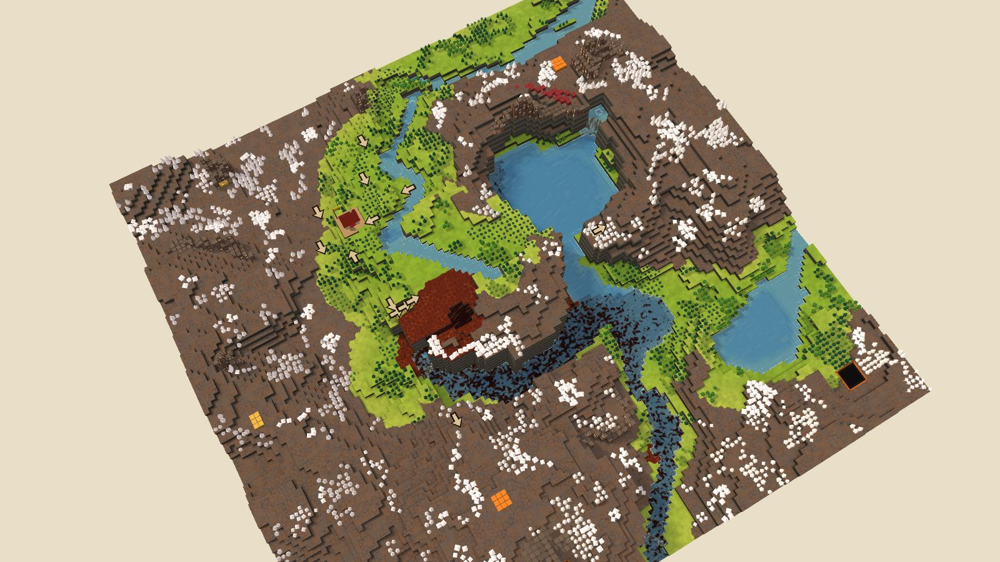
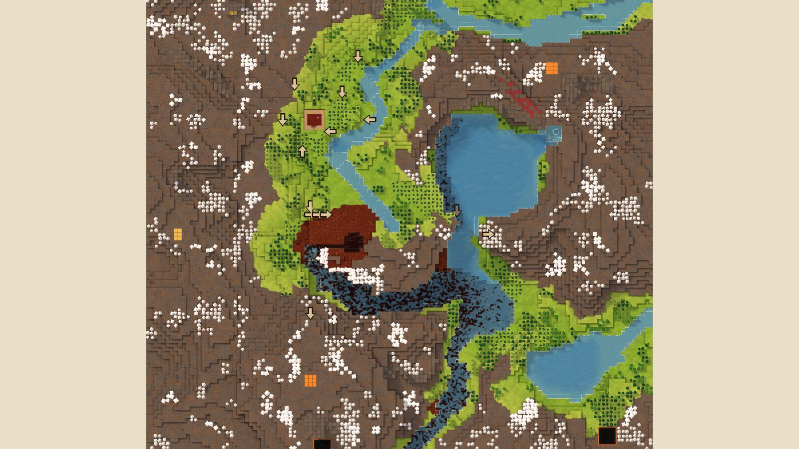

# 2. Badwater Cone

River Valley, 128², designed for Normal, seed 40, Verticality 21 (the theme's default). Prototype 0.7.0-proto2.1.
File: [out/v2/Badwater Cone (River Valley 40).timber](../../out/v2/Badwater%20Cone%20(River%20Valley%2040).timber).

*Rendered with dev's 3D view; the clean look re-renders these once Kyler approves it.*

## Intention

- A hidden valley up the cliffs, reached only by stairs, holds riches. **Emerged** (1 upland cut off by cliffs, reached only by stairs, with riches (largest 1021 tiles)).

## How it plays

- You start by a river, 6 tiles away on your level.
- It lasts through the first drought; in a 26-day Hard drought it is gone by day 9.
- A 2-tile dam 36 tiles east holds a drought's water.
- Badwater lies 31 tiles south.
- A valley up the cliffs holds riches: build stairs to reach it.
- Expand to the east and south, on narrow ledges.
- Most of the high ground needs stairs.
- Further out: mine sites, a geothermal field, relics, other lakes and rivers, waterfalls and most of the ruins.

## Terrain

- **Land:** caldera, basin, plateau, escarpment, cone over land falling toward the south-east.
- **Relief:** 13 levels (p5–p95), 15 levels in use, highest 16; 11% cliff, 33% flat; tallest fall 6 levels.
- **Water:** 4 rivers (0 from the edge, 4 from springs), 3 lakes, 7 falls, a river island, a delta; water covers 13% of the map.
- **Reach:** 4% of the dry land is reached on foot from the start; 96% needs stairs (1 natural ramp, 0 uplands left to stairs).
- **Badwater:** a hollow on high ground, draining by its own ditch.

## Cycle timeline

The exact cycle model (`investigation/cycles`), before anything is built; the worst of weather seeds 1729, 7, 99 (seed 1729).

| Weather | At its end | The start's pumpable water | Afterwards |
|---|---|---|---|
| First drought, Normal (3 days) | 30% of the water left | keeps it throughout | back in 2 days |
| Later drought, Hard (26 days) | 0% of the water left | gone by day 9 | back in 3 days |
| First badtide, Normal (2 days) | 2,228 tiles of badwater | gone by day 1 | back in 2 days |

## Strategy axes

The verified mechanics study's eight axes (branch `investigation/mechanics-verified`, measurement version 3), each in its fixed bins (bin 0 is the lowest).

| Axis | Value | Bin |
|---|---|---|
| Storage work | 0.14 × a Normal drought's need kept by the land within 40 tiles | 0 of 3 |
| Power location | 1.09 blocks/s through the best water-wheel spot within reach | 2 of 3 |
| Land and height | 132 dry tiles on the start's level within 40 tiles' walk | 0 of 3 |
| Fertile land | 28% of the moist land near the start still moist after a drought | 1 of 2 |
| Threat exposure | 23.5 tiles to the nearest badwater or contaminated soil | 1 of 3 |
| Resource timing | 66 logs standing within 20 tiles' walk | 0 of 3 |
| Expansion choice | 2 separate regions to expand into beyond 20 tiles | 1 of 2 |
| Faction opportunity | 3 extra shore tiles an Iron Teeth deep pump reaches | 1 of 3 |

Its position suits: Hard (docs/m9-design.md §11, a proposal).

## Name

**Badwater Cone**, by the names study's rule `badwater-cone`: A cone frames a contained badwater basin. Keep colonies on the clean side while you manage its leveed outlet.
