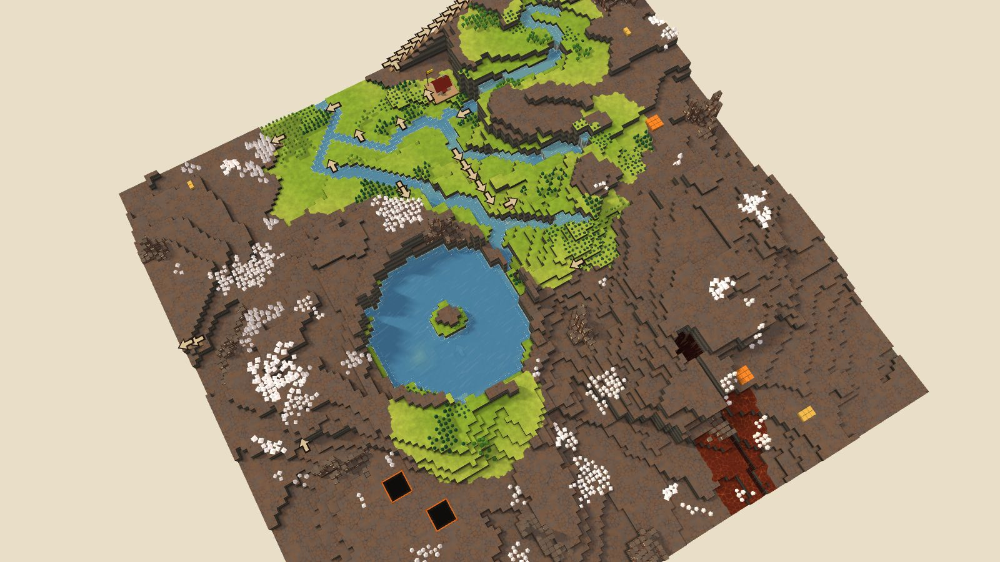
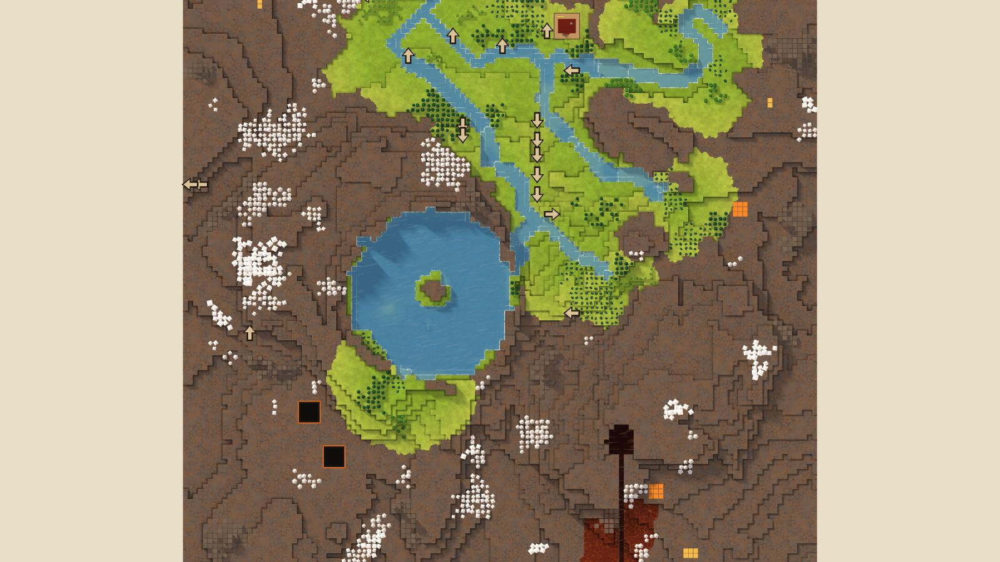

# 3. Mesa Field

Highlands, 128², designed for Normal, seed 44, Verticality 43 (the theme's default). Prototype 0.7.0-proto2.1.
File: [out/v2/Mesa Field (Highlands 44).timber](../../out/v2/Mesa%20Field%20(Highlands%2044).timber).

*Rendered with dev's 3D view; the clean look re-renders these once Kyler approves it.*

## Intention

- A hidden valley up the cliffs, reached only by stairs, holds riches. **Dropped** (no upland cut off by cliffs with riches within 60 tiles).
- A signature landmark stands out: a spire, a mesa, a peak or a tall waterfall. **Emerged** (29 standing forms of 300 tiles or fewer (the most prominent 11 levels over its ring), tallest fall 4.8).

## How it plays

- You start by a lake, 5 tiles away on your level.
- In the first drought it is gone by day 1: store water before it.
- A 5-tile dam 18 tiles south-east holds a drought's water.
- Badwater lies 84 tiles south.
- A landmark stands out: you can see it from anywhere on the map.
- Expand to the east and west, on narrow ledges.
- Further out: mine sites, a geothermal field, relics, waterfalls and most of the ruins.

## Terrain

- **Land:** escarpment, plateau, mesa, ridge, spiral, trough, basin, caldera over land falling toward the north-east.
- **Relief:** 14 levels (p5–p95), 17 levels in use, highest 16; 25% cliff, 44% flat; tallest fall 4.83 levels.
- **Water:** 5 rivers (0 from the edge, 5 from springs), 1 lake, 10 falls; water covers 9% of the map.
- **Reach:** 16% of the dry land is reached on foot from the start; 84% needs stairs (4 natural ramps, 2 uplands left to stairs).
- **Badwater:** a hollow on high ground, draining by its own ditch.

## Cycle timeline

The exact cycle model (`investigation/cycles`), before anything is built; the worst of weather seeds 1729, 7, 99 (seed 1729).

| Weather | At its end | The start's pumpable water | Afterwards |
|---|---|---|---|
| First drought, Normal (3 days) | 69% of the water left | gone by day 1 | back in 2 days |
| Later drought, Hard (26 days) | 22% of the water left | gone by day 1 | back in 3 days |
| First badtide, Normal (2 days) | 1,531 tiles of badwater | gone by day 1 | back in 5 days |

## Strategy axes

The verified mechanics study's eight axes (branch `investigation/mechanics-verified`, measurement version 3), each in its fixed bins (bin 0 is the lowest).

| Axis | Value | Bin |
|---|---|---|
| Storage work | 0.01 × a Normal drought's need kept by the land within 40 tiles | 0 of 3 |
| Power location | 2.06 blocks/s through the best water-wheel spot within reach | 3 of 3 |
| Land and height | 231 dry tiles on the start's level within 40 tiles' walk | 1 of 3 |
| Fertile land | 0% of the moist land near the start still moist after a drought | 0 of 2 |
| Threat exposure | 83.7 tiles to the nearest badwater or contaminated soil | 3 of 3 |
| Resource timing | 74 logs standing within 20 tiles' walk | 0 of 3 |
| Expansion choice | 3 separate regions to expand into beyond 20 tiles | 1 of 2 |
| Faction opportunity | 0 extra shore tiles an Iron Teeth deep pump reaches | 0 of 3 |

Its position suits: none of the proposed difficulty positions (docs/m9-design.md §11, a proposal).

## Name

**Mesa Field**, by the names study's rule `mesa-field`: Several flat-topped mesas overlook the lower ground. Choose one shelf to settle, then connect its height to the river.
