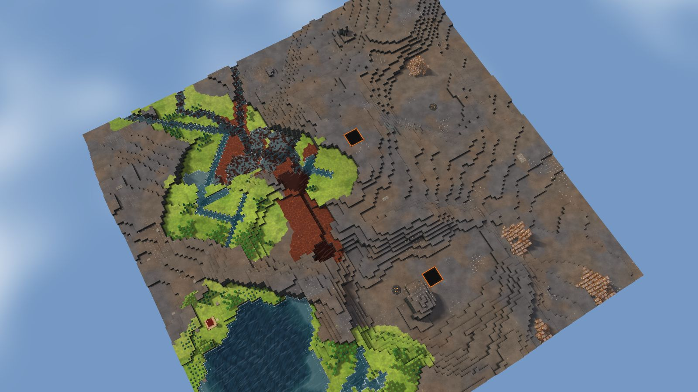
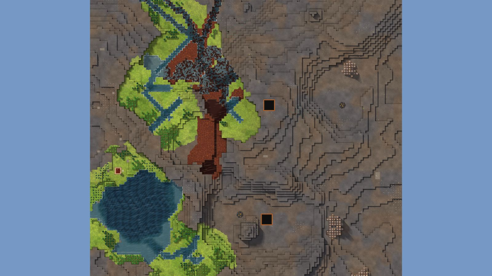

# 4. Paired Falls

Delta, 128², designed for Normal, seed 41, Verticality 10 (the theme's default). Prototype 0.7.0-proto2.1.
File: [out/v2/Paired Falls (Delta 41).timber](../../out/v2/Paired%20Falls%20(Delta%2041).timber).

*Rendered with the app's 3D view, in the clean look.*

## Intention

- A waterfall plunges off a cliff into a large, roughly round lake (Kyler's own). **Emerged** (a lake of 881 tiles of open water (axes 0.95, fill 0.66) with a fall of 3.4 levels into it).
- Two rivers meet by the start. **Dropped** (no confluence within 18 tiles).

## How it plays

- You start by a lake, 3 tiles away on your level.
- It lasts through the first drought; in a 26-day Hard drought it is gone by day 19.
- A 9-tile dam by the start holds a drought's water.
- Badwater lies 33 tiles east.
- A waterfall plunges off a cliff into a big, round lake.
- Expand to the north and south, on some level land.
- Most of the high ground needs stairs.
- Further out: mine sites, a geothermal field, relics, another lake or river, waterfalls and most of the ruins.

## Terrain

- **Land:** basin, escarpment over land with no one regional slope.
- **Relief:** 12 levels (p5–p95), 15 levels in use, highest 15; 8% cliff, 38% flat; tallest fall 5.39 levels.
- **Water:** 3 rivers (0 from the edge, 3 from springs), 1 lake, 5 falls, a delta; water covers 10% of the map.
- **Reach:** 8% of the dry land is reached on foot from the start; 93% needs stairs (1 natural ramp, 1 upland left to stairs).
- **Badwater:** a hollow on high ground, draining by its own ditch.

## Cycle timeline

The exact cycle model (`investigation/cycles`), before anything is built; the worst of weather seeds 1729, 7, 99 (seed 1729).

| Weather | At its end | The start's pumpable water | Afterwards |
|---|---|---|---|
| First drought, Normal (3 days) | 74% of the water left | keeps it throughout | back within a day |
| Later drought, Hard (26 days) | 43% of the water left | gone by day 19 | not back within 5 days |
| First badtide, Normal (2 days) | 1,599 tiles of badwater | gone by day 1 | not back within 5 days |

## Strategy axes

The verified mechanics study's eight axes (`investigation/mechanics`, measurement version 3), each in its fixed bins (bin 0 is the lowest).

| Axis | Value | Bin |
|---|---|---|
| Storage work | 8.59 × a Normal drought's need kept by the land within 40 tiles | 3 of 3 |
| Power location | 0.65 blocks/s through the best water-wheel spot within reach | 1 of 3 |
| Land and height | 374 dry tiles on the start's level within 40 tiles' walk | 1 of 3 |
| Fertile land | 64% of the moist land near the start still moist after a drought | 1 of 2 |
| Threat exposure | 28.8 tiles to the nearest badwater or contaminated soil | 1 of 3 |
| Resource timing | 178 logs standing within 20 tiles' walk | 2 of 3 |
| Expansion choice | 3 separate regions to expand into beyond 20 tiles | 1 of 2 |
| Faction opportunity | 0 extra shore tiles an Iron Teeth deep pump reaches | 0 of 3 |

Its position suits: Normal (docs/m9-design.md §11, a proposal).

## Name

**Paired Falls**, by the names study's rule `paired-falls`: Two falls break the river into separate levels. Build crossings between them before spreading along both banks.
