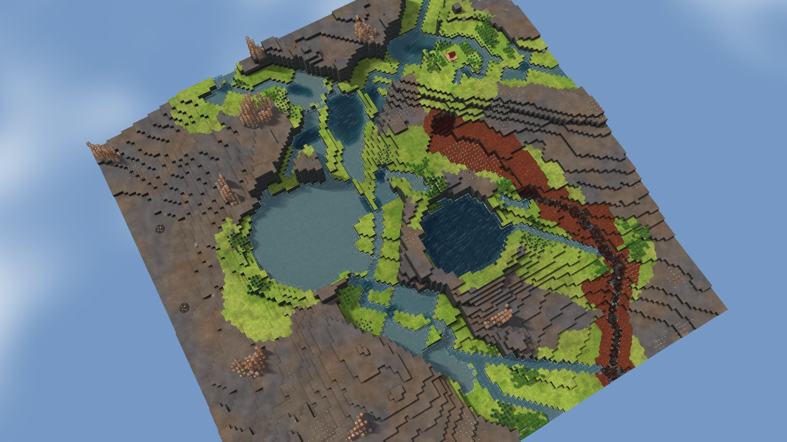
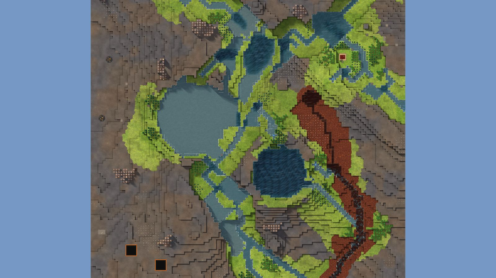

# 5. Lake Steps

Delta, 128², designed for Normal, seed 48, Verticality 12 (the theme's default). Prototype 0.7.0-proto2.1.
File: [out/v2/Lake Steps (Delta 48).timber](../../out/v2/Lake%20Steps%20(Delta%2048).timber).

*Rendered with the app's 3D view, in the clean look.*

## Intention

- Two rivers meet by the start. **Emerged** (a confluence 10 tiles from the start).
- A large crater gathers two or more rivers into its lake, which leaves through a gap in the rim (Kyler's own). **Dropped** (a 310-tile lake: rim on 15 of 16 rays (falling again outside on 14), 1 river in, 1 way out).

## How it plays

- You start by a river, 3 tiles away on your level.
- It lasts through the first drought; in a 26-day Hard drought it is gone by day 6.
- An 11-tile dam 10 tiles north-west holds a drought's water.
- Badwater lies 18 tiles south-west.
- 135 logs of wood within 20 tiles' walk, mostly oak: plenty of wood, slow to regrow; plus about 60 logs growing.
- Two rivers meet by the start.
- Expand to the east, north-east and south-east, on narrow ledges.
- Most of the high ground needs stairs.
- Further out: mine sites, a geothermal field, relics, other lakes and rivers, waterfalls and most of the ruins.

## Terrain

- **Land:** caldera, trough, ridge over land falling toward the south-west.
- **Relief:** 14 levels (p5–p95), 17 levels in use, highest 16; 13% cliff, 36% flat; tallest fall 1.05 levels.
- **Water:** 9 rivers (3 from the edge, 6 from springs), 3 lakes, 0 falls, a delta; water covers 11% of the map.
- **Reach:** 5% of the dry land is reached on foot from the start; 95% needs stairs (1 natural ramp, 5 uplands left to stairs).
- **Badwater:** a hollow on high ground, draining by its own ditch.

## Cycle timeline

The exact cycle model (`investigation/cycles`), before anything is built; the worst of weather seeds 1729, 7, 99 (seed 1729).

| Weather | At its end | The start's pumpable water | Afterwards |
|---|---|---|---|
| First drought, Normal (3 days) | 77% of the water left | keeps it throughout | not back within 5 days |
| Later drought, Hard (26 days) | 43% of the water left | gone by day 6 | not back within 5 days |
| First badtide, Normal (2 days) | 2,519 tiles of badwater | gone by day 1 | not back within 5 days |

## Strategy axes

The verified mechanics study's eight axes (`investigation/mechanics`, measurement version 3) and the woods (D164), each in its fixed bins (bin 0 is the lowest).

| Axis | Value | Bin |
|---|---|---|
| Storage work | 0.8 × a Normal drought's need kept by the land within 40 tiles | 1 of 3 |
| Power location | 0.33 blocks/s through the best water-wheel spot within reach | 0 of 3 |
| Land and height | 93 dry tiles on the start's level within 40 tiles' walk | 0 of 3 |
| Fertile land | 0% of the moist land near the start still moist after a drought | 0 of 2 |
| Threat exposure | 16.6 tiles to the nearest badwater or contaminated soil | 1 of 3 |
| Resource timing | 124 logs standing within 20 tiles' walk | 1 of 3 |
| Expansion choice | 1 separate regions to expand into beyond 20 tiles | 0 of 2 |
| Faction opportunity | 0 extra shore tiles an Iron Teeth deep pump reaches | 0 of 3 |
| Resource timing: the woods | 83% of the starting wood is oak (plenty of wood, slow to regrow; the rest pine and birch, quick) | 2 of 2 |

Its position suits: Hard (docs/m9-design.md §11, a proposal).

## Name

**Lake Steps**, by the names study's rule `lake-steps`: A chain of lakes descends through short channels. Secure the upper outlets first; each lower basin drains sooner.
