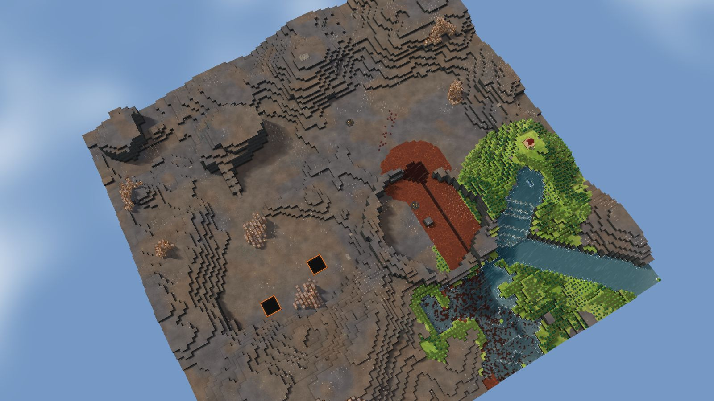
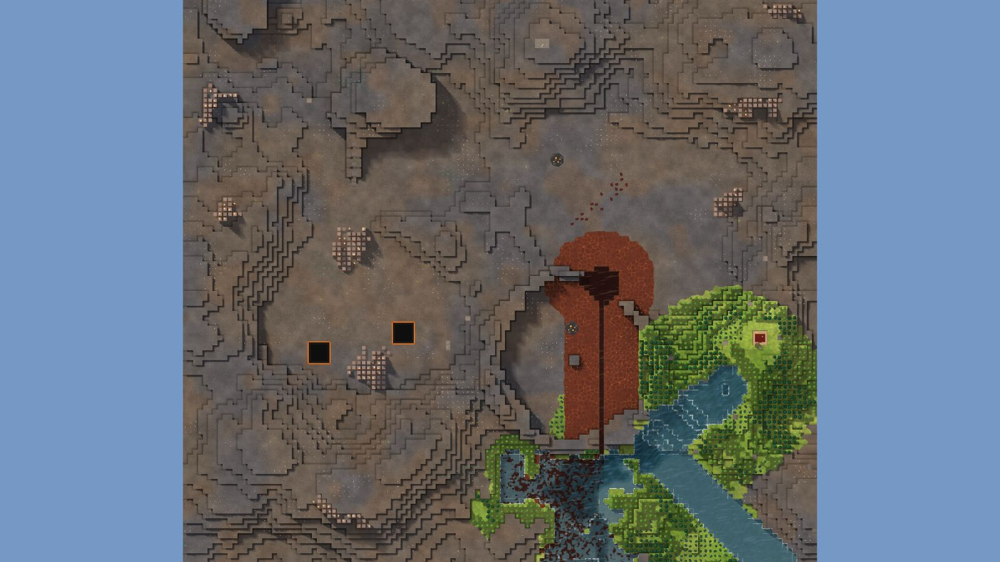

# 6. Badwater Cone

Islands, 128², designed for Normal, seed 37, Verticality 17 (the theme's default). Prototype 0.7.0-proto2.1.
File: [out/v2/Badwater Cone (Islands 37).timber](../../out/v2/Badwater%20Cone%20(Islands%2037).timber).

*Rendered with the app's 3D view, in the clean look.*

## Intention

- A signature landmark stands out: a spire, a mesa, a peak or a tall waterfall. **Emerged** (46 standing forms of 300 tiles or fewer (the most prominent 11 levels over its ring), tallest fall 3.9).

## How it plays

- You start by a river, 6 tiles away on your level.
- In the first drought it is gone by day 1: store water before it.
- No short dam holds a drought's water near the start: build levees or dig a reservoir.
- Badwater lies 31 tiles west, and some reaches your water.
- 170 logs of wood within 20 tiles' walk, mostly pine and birch: little wood a tree, quick to regrow; plus about 100 logs growing.
- A landmark stands out: you can see it from anywhere on the map.
- Expand to the north, west and south, on narrow ledges.
- Most of the high ground needs stairs.
- Further out: mine sites, a geothermal field, relics and most of the ruins.

## Terrain

- **Land:** basin, cone, mesa, caldera over a bowl draining toward the north-east.
- **Relief:** 9 levels (p5–p95), 12 levels in use, highest 14; 8% cliff, 38% flat; tallest fall 3.85 levels.
- **Water:** 1 river (0 from the edge, 1 from springs), 2 lakes, 1 fall; water covers 7% of the map.
- **Reach:** 5% of the dry land is reached on foot from the start; 95% needs stairs (1 natural ramp, 0 uplands left to stairs).
- **Badwater:** a hollow on high ground, draining by its own ditch.

## Cycle timeline

The exact cycle model (`investigation/cycles`), before anything is built; the worst of weather seeds 1729, 7, 99 (seed 1729).

| Weather | At its end | The start's pumpable water | Afterwards |
|---|---|---|---|
| First drought, Normal (3 days) | 9% of the water left | none from the first day | not back within 5 days |
| Later drought, Hard (26 days) | 0% of the water left | none from the first day | not back within 5 days |
| First badtide, Normal (2 days) | 1,150 tiles of badwater | gone by day 1 | not back within 5 days |

## Strategy axes

The verified mechanics study's eight axes (`investigation/mechanics`, measurement version 3) and the woods (D164), each in its fixed bins (bin 0 is the lowest).

| Axis | Value | Bin |
|---|---|---|
| Storage work | 0 × a Normal drought's need kept by the land within 40 tiles | 0 of 3 |
| Power location | 1.82 blocks/s through the best water-wheel spot within reach | 2 of 3 |
| Land and height | 201 dry tiles on the start's level within 40 tiles' walk | 1 of 3 |
| Fertile land | 0% of the moist land near the start still moist after a drought | 0 of 2 |
| Threat exposure | 23.5 tiles to the nearest badwater or contaminated soil | 1 of 3 |
| Resource timing | 136 logs standing within 20 tiles' walk | 1 of 3 |
| Expansion choice | 2 separate regions to expand into beyond 20 tiles | 1 of 2 |
| Faction opportunity | 2 extra shore tiles an Iron Teeth deep pump reaches | 1 of 3 |
| Resource timing: the woods | 0% of the starting wood is oak (plenty of wood, slow to regrow; the rest pine and birch, quick) | 0 of 2 |

Its position suits: Hard (docs/m9-design.md §11, a proposal).

## Name

**Badwater Cone**, by the names study's rule `badwater-cone`: A cone frames a contained badwater basin. Keep colonies on the clean side while you manage its leveed outlet.
