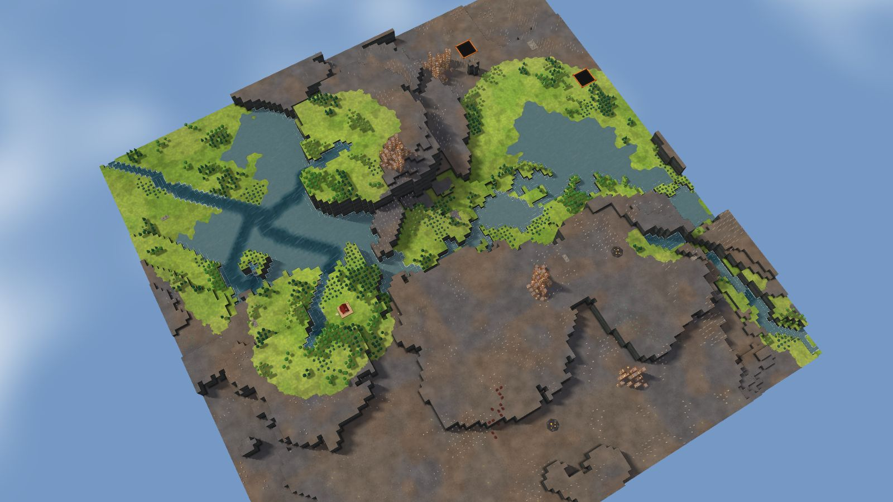
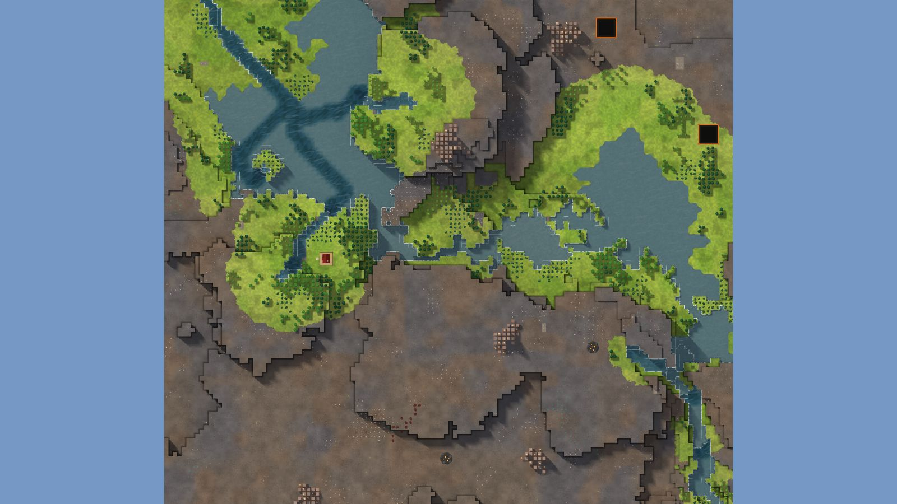

# 7. Scarp Gate

Canyon, 128², designed for Normal, seed 46, Verticality 87 (set to 85: high). Prototype 0.7.0-proto2.1.
File: [out/v2/Scarp Gate (Canyon 46, Verticality 85).timber](../../out/v2/Scarp%20Gate%20(Canyon%2046,%20Verticality%2085).timber).

*Rendered with the app's 3D view, in the clean look.*

## Intention

- A signature landmark stands out: a spire, a mesa, a peak or a tall waterfall. **Emerged** (13 standing forms of 300 tiles or fewer (the most prominent 8 levels over its ring), tallest fall 7.1).

## How it plays

- You start by a river, 3 tiles away on your level.
- In the first drought it is gone by day 1: store water before it.
- No short dam holds a drought's water near the start: build levees or dig a reservoir.
- Thorns bar the way south-east, 40 tiles out.
- A landmark stands out: you can see it from anywhere on the map.
- Expand to the south-west and south, on some level land.
- Further out: mine sites, a geothermal field, relics, another lake or river, waterfalls and most of the ruins.

## Terrain

- **Land:** escarpment, mesa, plateau over land falling toward the north-east.
- **Relief:** 12 levels (p5–p95), 12 levels in use, highest 16; 13% cliff, 71% flat; tallest fall 7.1 levels.
- **Water:** 4 rivers (0 from the edge, 4 from springs), 0 lakes, 6 falls; water covers 3% of the map.
- **Reach:** 26% of the dry land is reached on foot from the start; 74% needs stairs (3 natural ramps, 7 uplands left to stairs).
- **Badwater:** none.

## Cycle timeline

The exact cycle model (`investigation/cycles`), before anything is built; the worst of weather seeds 1729, 7, 99 (seed 1729).

| Weather | At its end | The start's pumpable water | Afterwards |
|---|---|---|---|
| First drought, Normal (3 days) | 7% of the water left | none from the first day | back in 2 days |
| Later drought, Hard (26 days) | 0% of the water left | none from the first day | back in 2 days |
| First badtide, Normal (2 days) | 1,262 tiles of badwater | gone by day 1 | not back within 5 days |

## Strategy axes

The verified mechanics study's eight axes (`investigation/mechanics`, measurement version 3), each in its fixed bins (bin 0 is the lowest).

| Axis | Value | Bin |
|---|---|---|
| Storage work | 0.01 × a Normal drought's need kept by the land within 40 tiles | 0 of 3 |
| Power location | 0.72 blocks/s through the best water-wheel spot within reach | 1 of 3 |
| Land and height | 748 dry tiles on the start's level within 40 tiles' walk | 2 of 3 |
| Fertile land | 0% of the moist land near the start still moist after a drought | 0 of 2 |
| Threat exposure | none found | – |
| Resource timing | 274 logs standing within 20 tiles' walk | 2 of 3 |
| Expansion choice | 2 separate regions to expand into beyond 20 tiles | 1 of 2 |
| Faction opportunity | 4 extra shore tiles an Iron Teeth deep pump reaches | 1 of 3 |

Its position suits: none of the proposed difficulty positions (docs/m9-design.md §11, a proposal).

## Name

**Scarp Gate**, by the names study's rule `scarp-gate`: A long scarp divides high ground from the valley. Place slopes along the rim before extending the colony downhill.
