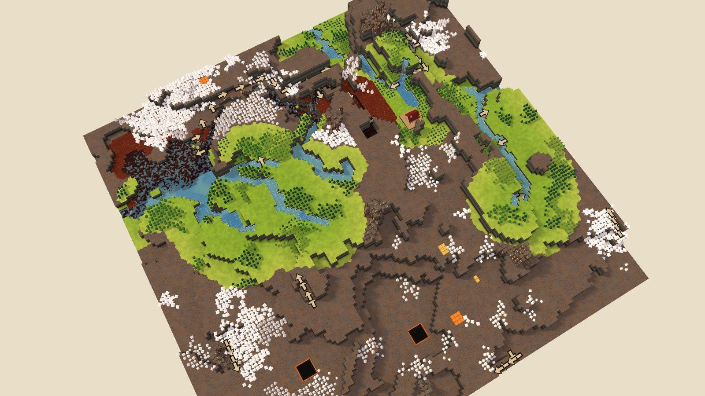
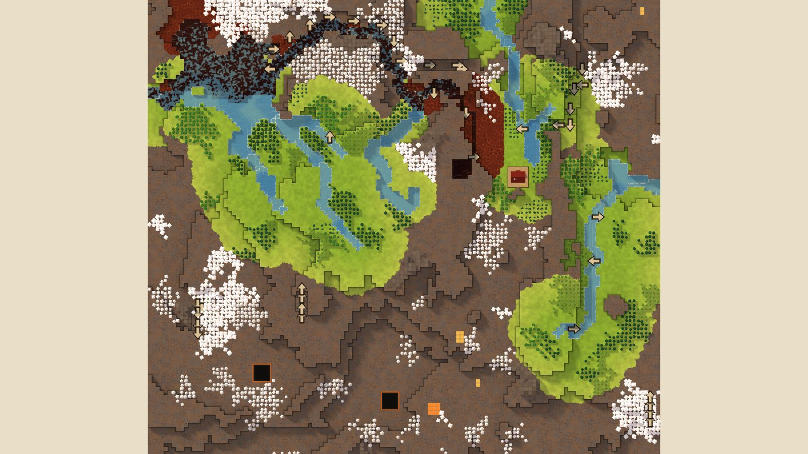

# 8. Lake Steps

Highlands, 128², designed for Normal, seed 43, Verticality 88 (set to 85: high). Prototype 0.7.0-proto2.1.
File: [out/v2/Lake Steps (Highlands 43, Verticality 85).timber](../../out/v2/Lake%20Steps%20(Highlands%2043,%20Verticality%2085).timber).

*Rendered with dev's 3D view; the clean look re-renders these once Kyler approves it.*

## Intention

- The start looks out from high ground over the land below. **Emerged** (start at level 11 (map's 75th percentile 11), 5 levels above the lowest ground within 15 tiles).

## How it plays

- You start by a lake, 3 tiles away on your level.
- It lasts through the first drought; in a 26-day Hard drought it is gone by day 16.
- A 2-tile dam 38 tiles west holds a drought's water.
- Badwater lies 11 tiles west.
- You start on high ground, looking out over the land below.
- Expand on every side, on some level land.
- Further out: mine sites, a geothermal field, relics, other lakes and rivers, waterfalls and most of the ruins.

## Terrain

- **Land:** mesa, ridge, escarpment, spiral over land falling toward the north.
- **Relief:** 14 levels (p5–p95), 7 levels in use, highest 15; 26% cliff, 60% flat; tallest fall 4.15 levels.
- **Water:** 7 rivers (0 from the edge, 7 from springs), 0 lakes, 13 falls; water covers 6% of the map.
- **Reach:** 78% of the dry land is reached on foot from the start; 22% needs stairs (7 natural ramps, 7 uplands left to stairs).
- **Badwater:** a hollow on high ground, draining by its own ditch.

## Cycle timeline

The exact cycle model (`investigation/cycles`), before anything is built; the worst of weather seeds 1729, 7, 99 (seed 1729).

| Weather | At its end | The start's pumpable water | Afterwards |
|---|---|---|---|
| First drought, Normal (3 days) | 39% of the water left | keeps it throughout | not back within 5 days |
| Later drought, Hard (26 days) | 16% of the water left | gone by day 16 | not back within 5 days |
| First badtide, Normal (2 days) | 1,523 tiles of badwater | gone by day 1 | not back within 5 days |

## Strategy axes

The verified mechanics study's eight axes (branch `investigation/mechanics-verified`, measurement version 3), each in its fixed bins (bin 0 is the lowest).

| Axis | Value | Bin |
|---|---|---|
| Storage work | 0.53 × a Normal drought's need kept by the land within 40 tiles | 1 of 3 |
| Power location | 1.43 blocks/s through the best water-wheel spot within reach | 2 of 3 |
| Land and height | 802 dry tiles on the start's level within 40 tiles' walk | 2 of 3 |
| Fertile land | 66% of the moist land near the start still moist after a drought | 1 of 2 |
| Threat exposure | 3.8 tiles to the nearest badwater or contaminated soil | 0 of 3 |
| Resource timing | 372 logs standing within 20 tiles' walk | 3 of 3 |
| Expansion choice | 3 separate regions to expand into beyond 20 tiles | 1 of 2 |
| Faction opportunity | 2 extra shore tiles an Iron Teeth deep pump reaches | 1 of 3 |

Its position suits: Hard (docs/m9-design.md §11, a proposal).

## Name

**Lake Steps**, by the names study's rule `lake-steps`: A chain of lakes descends through short channels. Secure the upper outlets first; each lower basin drains sooner.
