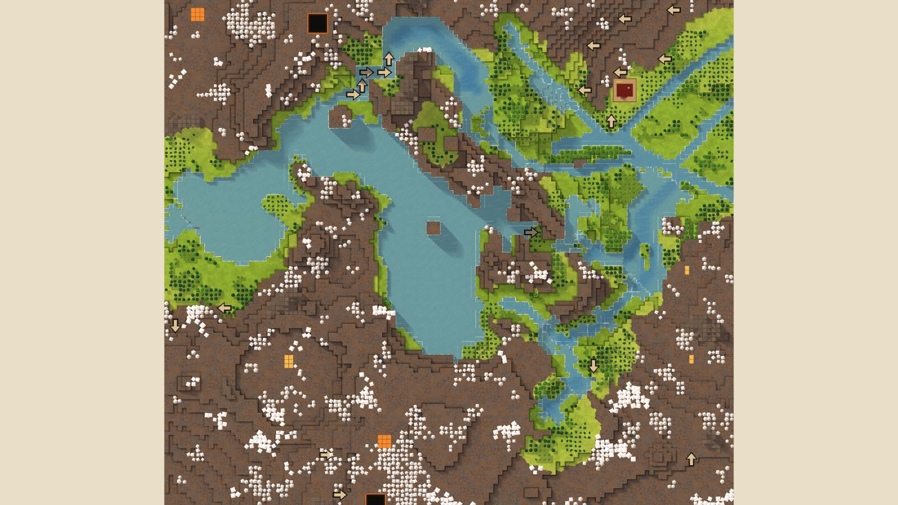

# 9. Highland Stair

Lake Basin, 128², designed for Normal, seed 33, Verticality 82 (set to 85: high). Prototype 0.7.0-proto2.1.
File: [out/v2/Highland Stair (Lake Basin 33, Verticality 85).timber](../../out/v2/Highland%20Stair%20(Lake%20Basin%2033,%20Verticality%2085).timber).

*Rendered with dev's 3D view; the clean look re-renders these once Kyler approves it.*

## Intention

- The only safe water is uphill: a high lake keeps its water when the river runs low. **Emerged** (start's water keeps 0% through a 9-day drought; a lake uphill keeps 55%).

## How it plays

- You start by a river, 4 tiles away on your level.
- In the first drought it is gone by day 1: store water before it.
- A 10-tile dam by the start holds a drought's water.
- In a long drought the river runs low, but a lake uphill keeps its water.
- Expand to the north-east and north, on narrow ledges.
- Most of the high ground needs stairs.
- Further out: mine sites, a geothermal field, relics, waterfalls and most of the ruins.

## Terrain

- **Land:** ridge, spiral, basin over land with no one regional slope; recipe: chain-of-lakes.
- **Relief:** 13 levels (p5–p95), 17 levels in use, highest 16; 26% cliff, 42% flat; tallest fall 4.03 levels.
- **Water:** 5 rivers (0 from the edge, 5 from springs), 0 lakes, 5 falls, a river island, a delta; water covers 5% of the map.
- **Reach:** 6% of the dry land is reached on foot from the start; 94% needs stairs (2 natural ramps, 5 uplands left to stairs).
- **Badwater:** none.

## Cycle timeline

The exact cycle model (`investigation/cycles`), before anything is built; the worst of weather seeds 1729, 7, 99 (seed 1729).

| Weather | At its end | The start's pumpable water | Afterwards |
|---|---|---|---|
| First drought, Normal (3 days) | 23% of the water left | none from the first day | back within a day |
| Later drought, Hard (26 days) | 3% of the water left | none from the first day | back within a day |
| First badtide, Normal (2 days) | 2,340 tiles of badwater | gone by day 1 | back in 4 days |

## Strategy axes

The verified mechanics study's eight axes (branch `investigation/mechanics-verified`, measurement version 3), each in its fixed bins (bin 0 is the lowest).

| Axis | Value | Bin |
|---|---|---|
| Storage work | 0.25 × a Normal drought's need kept by the land within 40 tiles | 0 of 3 |
| Power location | 0.91 blocks/s through the best water-wheel spot within reach | 1 of 3 |
| Land and height | 256 dry tiles on the start's level within 40 tiles' walk | 1 of 3 |
| Fertile land | 0% of the moist land near the start still moist after a drought | 0 of 2 |
| Threat exposure | none found | – |
| Resource timing | 102 logs standing within 20 tiles' walk | 1 of 3 |
| Expansion choice | 2 separate regions to expand into beyond 20 tiles | 1 of 2 |
| Faction opportunity | 0 extra shore tiles an Iron Teeth deep pump reaches | 0 of 3 |

Its position suits: Normal (docs/m9-design.md §11, a proposal).

## Name

**Highland Stair**, by the names study's rule `highland-stair`: A stream drops over several high terraces. Follow it down for clean water and connect the shelves with slopes.
