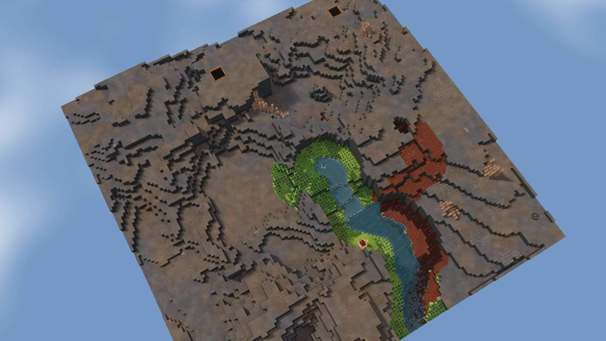
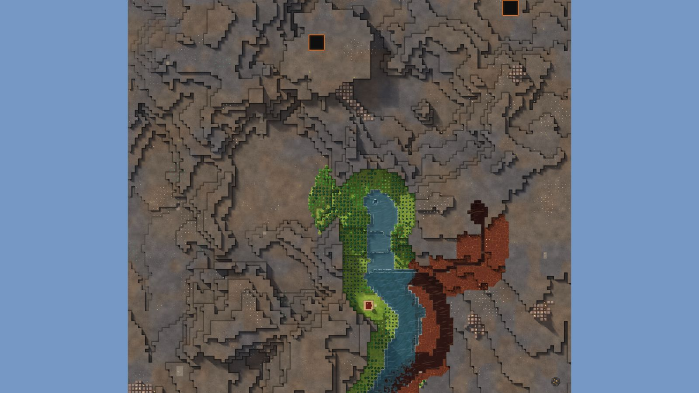

# 10. Dryroot Basin

Canyon, 128², designed for Normal, seed 8, Verticality 40 (the theme's default). Prototype 0.7.0-proto2.1.
File: [out/v2/Dryroot Basin (Canyon 8).timber](../../out/v2/Dryroot%20Basin%20(Canyon%208).timber).

*Rendered with the app's 3D view, in the clean look.*

## Intention

- None drawn. Some maps have none, so intentions never become a template.

## How it plays

- You start by a river, 2 tiles away on your level.
- In the first drought it is gone by day 1: store water before it.
- A 15-tile dam by the start holds a drought's water.
- Badwater lies 13 tiles north-east, and some reaches your water.
- Expand to the east and south, on narrow ledges.
- Most of the high ground needs stairs.
- Further out: mine sites, a geothermal field, relics and most of the ruins.

## Terrain

- **Land:** mesa, basin over land falling toward the south-east.
- **Relief:** 13 levels (p5–p95), 10 levels in use, highest 16; 37% cliff, 46% flat; tallest fall 7 levels.
- **Water:** 1 river (0 from the edge, 1 from springs), 1 lake, 5 falls, a river island; water covers 5% of the map.
- **Reach:** 4% of the dry land is reached on foot from the start; 96% needs stairs (8 natural ramps, 0 uplands left to stairs).
- **Badwater:** a hollow on high ground, draining by its own ditch.

## Cycle timeline

The exact cycle model (`investigation/cycles`), before anything is built; the worst of weather seeds 1729, 7, 99 (seed 1729).

| Weather | At its end | The start's pumpable water | Afterwards |
|---|---|---|---|
| First drought, Normal (3 days) | 7% of the water left | none from the first day | back in 2 days |
| Later drought, Hard (26 days) | 0% of the water left | none from the first day | back in 2 days |
| First badtide, Normal (2 days) | 798 tiles of badwater | gone by day 1 | back within a day |

## Strategy axes

The verified mechanics study's eight axes (`investigation/mechanics`, measurement version 3), each in its fixed bins (bin 0 is the lowest).

| Axis | Value | Bin |
|---|---|---|
| Storage work | 0 × a Normal drought's need kept by the land within 40 tiles | 0 of 3 |
| Power location | 1.37 blocks/s through the best water-wheel spot within reach | 2 of 3 |
| Land and height | 291 dry tiles on the start's level within 40 tiles' walk | 1 of 3 |
| Fertile land | 0% of the moist land near the start still moist after a drought | 0 of 2 |
| Threat exposure | 7.8 tiles to the nearest badwater or contaminated soil | 0 of 3 |
| Resource timing | 196 logs standing within 20 tiles' walk | 2 of 3 |
| Expansion choice | 1 separate regions to expand into beyond 20 tiles | 0 of 2 |
| Faction opportunity | 0 extra shore tiles an Iron Teeth deep pump reaches | 0 of 3 |

Its position suits: Hard (docs/m9-design.md §11, a proposal).

## Name

**Dryroot Basin**, by the names study's rule `dryroot-basin`: The basin has little standing water and few living trees. Secure a reservoir early before expanding into the drier ground.
