# Landscape fixtures

88 converted patches from distinct sampling regions. Every fixture passed the unchanged TypeScript generate-profile checks after a fresh settle. Advisory failures remain in each file.

Open [gallery.html](gallery.html) for previews. Red marks the start; blue is simulated water. North is up.

Each gzip JSON stores row-major heights (y increases north), sources, start anchor, game entities, location, mapping, attribution and checks. `referenceHeights` keeps the same quantised patch before edge sealing, for fair terrain measurements. `heights` is the playable conversion. Sources and resources are simulated or placed for the game. Entity UUIDs are omitted for compact storage; the bench reconstructs them in stored order. Family labels describe sampling regions; a window may show only part of the named landform.

Use these for regression tests, tuning and an optional M11 import. Never load these into the generator as templates. See [attribution](../ATTRIBUTION.md).

## One example per sampling family

The full gallery and index include every fixture. These images show terrain, simulated water and the start.

| Family | Example | Preview |
|---|---|---|
| archipelago | [Near Thousand Islands Saint Lawrence, 60 m per tile](n384-128-60-normalised-16.json.gz) | 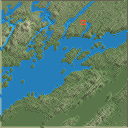 |
| badlands | [Near Badlands National Park (east sample), 30 m per tile](n181-128-30-normalised-16.json.gz) | 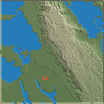 |
| braided | [Near Waimakariri River, 30 m per tile](n060-256-30-normalised-16.json.gz) | 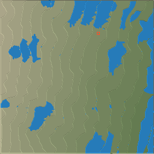 |
| caldera | [Near Sete Cidades, 60 m per tile](n128-96-60-normalised-16.json.gz) | 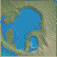 |
| canyon | [Near Blyde River Canyon (north sample), 30 m per tile](n014-96-30-normalised-16.json.gz) | 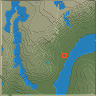 |
| coast | [Near Na Pali coast, 60 m per tile](n368-128-60-compressed-16.json.gz) | 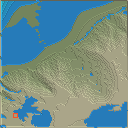 |
| cone | [Near Mount Taranaki, 30 m per tile](n144-256-30-normalised-16.json.gz) | 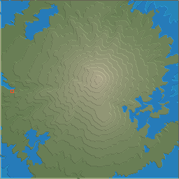 |
| confluence | [Near Rhine and Moselle, 60 m per tile](n328-128-60-normalised-16.json.gz) | 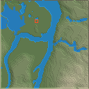 |
| delta | [Near Lena delta (southwest sample), 60 m per tile](n055-128-60-normalised-16.json.gz) | 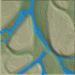 |
| escarpment | [Near Drakensberg Amphitheatre (north sample), 120 m per tile](n262-128-120-normalised-16.json.gz) | 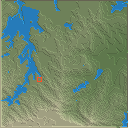 |
| falls | [Near Niagara Falls, 60 m per tile](n348-128-60-compressed-16.json.gz) | 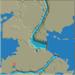 |
| fan | [Near Death Valley Badwater fan (east sample), 120 m per tile](n101-128-120-normalised-16.json.gz) | 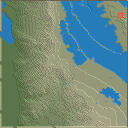 |
| fjord | [Near Milford Sound, 60 m per tile](n224-256-60-normalised-16.json.gz) | 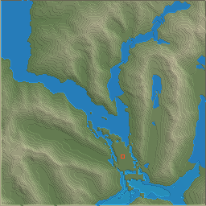 |
| glacial | [Near Lauterbrunnen (north sample), 120 m per tile](n246-256-120-normalised-16.json.gz) | 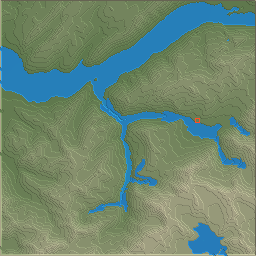 |
| gorge | [Near Verdon Gorge (north sample), 60 m per tile](n022-96-60-normalised-16.json.gz) | 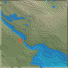 |
| karst | [Near Chocolate Hills (east sample), 120 m per tile](n209-96-120-normalised-16.json.gz) | 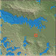 |
| lakes | [Near English Lake District, 60 m per tile](n300-128-60-normalised-16.json.gz) | 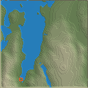 |
| meander | [Near Lower Mississippi oxbows (north sample), 60 m per tile](n098-256-60-normalised-16.json.gz) | 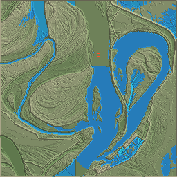 |
| mesa | [Near Monument Valley (southwest sample), 120 m per tile](n163-128-120-normalised-16.json.gz) | 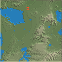 |
| plateau | [Near Colorado Plateau, 30 m per tile](n280-128-30-normalised-16.json.gz) | 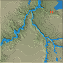 |
| random | [Random land 41, 60 m per tile](u040-128-60-normalised-16.json.gz) | 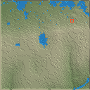 |
