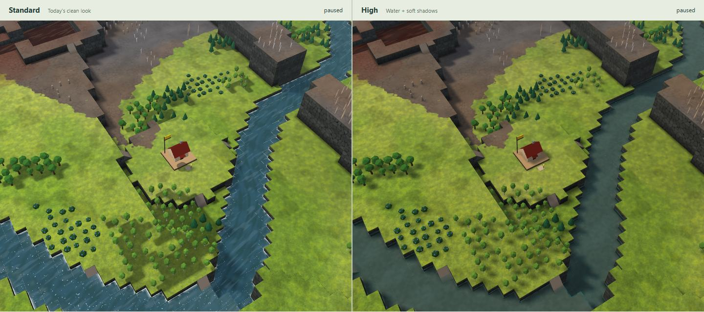
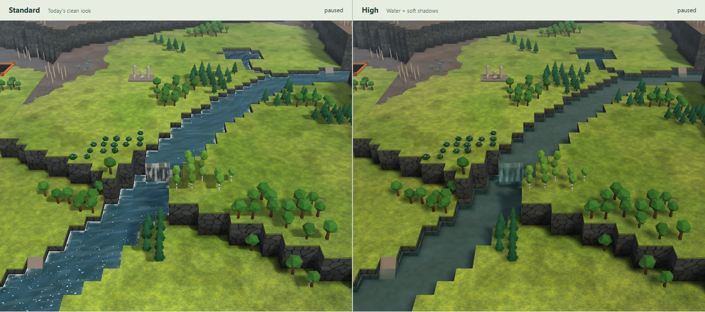
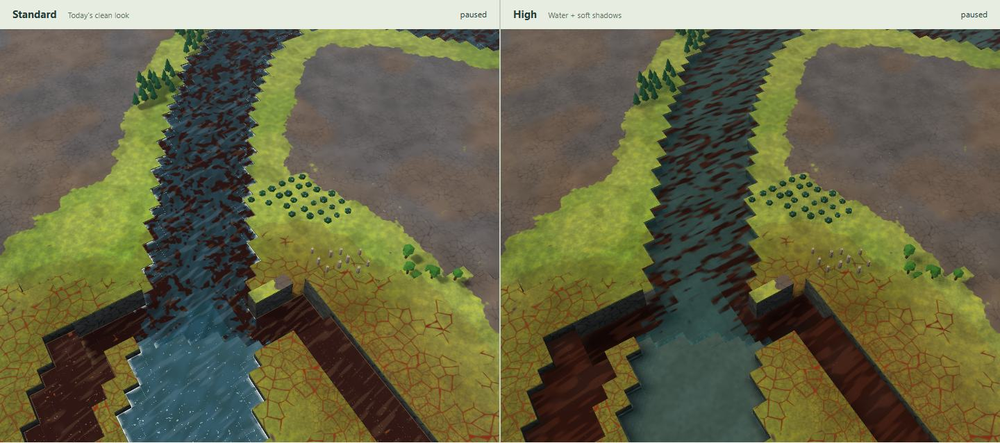

# Map look 2: water and shadows

Working prototype from dev `692dd72`, using three.js 0.186.0. Only this directory changes. Grass, dirt, contamination patterns and models are the existing clean look.

Run from the repository root:

```sh
npm --prefix investigation/maplook2 run demo
```

Use Node 22.12+ and open http://127.0.0.1:4197. First run installs this folder's locked dependencies. Choose a map, drag either view, and switch Water or Soft shadows separately. Sun turn demonstrates live shadow movement; Reset sun restores the comparison. FPS measures the combined workload of both views. Judge speed on your PC.

## Result and captures

Standard is on the left, High on the right; cameras and water time match. High has quieter teal water, clearer banks, depth absorption, angle-dependent sky reflection, soft foam and sparse sun glints. Badwater stays red-brown, with slow ribbons; mixed water keeps visible dark streaks. Actual tree and scaffold shapes now cast soft shadows. Wall-foot darkening is retained.







More comparisons: [badwater](captures/river-128-badwater.jpg), [wet/dry contaminated soil](captures/river-128-soil.jpg), [ruins](captures/river-128-ruins.jpg), [another angle](captures/river-128-start-angle.jpg), [256² overview](captures/river-256-overview.jpg), [shoreline](captures/lake-128-shore.jpg), [low angle](captures/lake-128-shore-low.jpg), [Real Victoria Falls](captures/real-victoria-falls.jpg), [Real Yosemite](captures/real-yosemite-cliff.jpg), [M9 Canyon](captures/m9-canyon-falls.jpg), [M9 River Valley](captures/m9-river-start.jpg), [water only](captures/water-only.jpg), [shadows only](captures/shadows-only.jpg), [demo controls](captures/demo.jpg).

Readability sheets include greyscale and three colour-vision simulations, using the repository's existing linear-RGB matrices: [start](captures/river-128-start-readability.jpg), [soil](captures/river-128-soil-readability.jpg), [mixed water](captures/river-256-meeting-readability.jpg). Grass remains textured and lighter than dry ground; contaminated veins remain visible over both. The start retains its roof, pale deck and banner. Water has fewer bright cues than Standard, so its channel shape, transparency and motion carry more of the reading. Very distant dry contaminated veins remain subtle, as in Standard.

## Checks

TypeScript and the production compilation pass. Headless Chrome/SwiftShader loaded **25 maps**: seed 4242 in all six themes at 128² and 256², three Real places, and all ten M9 files present. No page/shader errors. Both toggles produce distinct results; turning the sun changes High only; water animation changes High; dragging High synchronizes Standard. With both effects disabled, **all 1,711,220 pixel channels match Standard exactly**.

[Verification](captures/verification.json) records the renderer, map counts, camera poses, checks and visible water/soil sample tiles (pixel positions relative to High's canvas). These are evidence of execution and appearance, **not GPU performance measurements**. Captures use 1440×940, DPR 1, water time 8 s, JPEG 75–76; all images are under 260 KB, about 3 MB together. No game assets or game screenshots.

Reproduce with the demo running and Chrome installed: `npm --prefix investigation/maplook2 run capture`, then `node investigation/maplook2/readability.mjs`. `npm --prefix investigation/maplook2 run check` and `run build` check the code. The build is a compilation check; map discovery is served by the local demo server.

## Decisions

- Standard imports today's renderer and materials. A demo-only Vite transform disables automatic Light selection so software captures compare Standard with High. No source file is edited.
- High changes only water and sun shadows. Terrain patterns, soil/contamination, models, sky, grading and resolution remain the baseline. Existing contact darkening stays; no new AO pass.
- Generated maps use the repository generator in a worker; Real places use its library/build path; M9 files use its importer. No game assets or game captures are read or copied.
- The original checkout has unrelated edits. Work uses a separate worktree from dev and the explicitly authorized branch.
- Reflection is procedural sky, not reflected terrain. Foam uses existing tile flags; no physical flow is invented. The 2048² map-wide shadow softens small objects on large maps. None of the 25 maps has cave columns, so cave support remains a proposal, not a tested claim. See [INTEGRATION.md](INTEGRATION.md) for adoption, automatic High/fallback, M9/caves and likely costs.

## Steps

1. Read CLAUDE.md, PLAN §20 (D114, D147, D154), the clean-look notes/captures and src/render3d. Set up the isolated runner.
2. Built the worker-backed comparison and both effects. Initial SwiftShader images exposed self-shadow stripes; receiver-plane PCF correction removed them.
3. Kept badwater visibly liquid from above, captured all required meanings and angles, and passed the 25-map sweep plus parity/toggle/animation/camera checks. Added the integration proposals. Updated the unused local dev reference for the requested scope check; dev advanced only in planning documents during this work.
