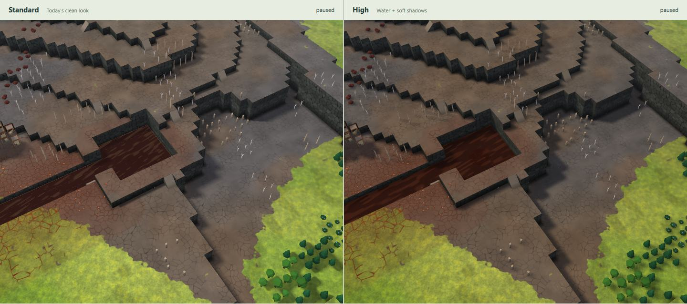

# Map look 2: water and shadows

Working prototype from dev `692dd72`, using three.js 0.186.0. Only this directory changes. Grass, dirt, contamination patterns and models are the existing clean look.

Run from the repository root:

```sh
npm --prefix investigation/maplook2 run demo
```

Use Node 22.12+ and open http://127.0.0.1:4197. First run installs this folder's locked dependencies. Choose a map, drag either view, and switch Water or Soft shadows separately. Sun turn demonstrates live shadow movement; Reset sun restores the comparison. FPS measures the combined workload of both views. Judge speed on your PC.

## Result and captures

Standard is on the left, High on the right; cameras and water time match. Badwater now has the requested brick-red hue, darker troughs and clearly lighter drifting streaks. Clean water, flow, bubbles, poisoned shallows, weak cool reflection and shadows retain their accepted treatment. The concentration filter and mixing anchor are unchanged; the revised badwater endpoint blends through the same soft front.

**Measured-colour revision:** this replaces the previous bright teal treatment. The colour constants compensate for the demo's lighting, warm finish and visible bed; simply entering the screenshot hex values as material inputs did not produce those colours on screen. No screenshot or game asset was loaded: only the supplied numeric measurements were used.

**Final prototype tuning:** generated maps and Real places use their existing settled outflows for direction and speed. M9 imports use a 128-tick estimate from their stored water through the repository simulator; displayed depths, soil and geometry never change. Velocity is compressed for readable motion while preserving direction. Still lakes retain slow wind drift. Two overlapping advection phases avoid stretching and reset pops; world-coordinate procedural noise replaces long streaks without a repeating texture tile.

The final mixing request replaces the old red/blue blotch mask with concentration-based colour. Two small smoothing passes follow connected wet tiles at the same surface height; bilinear interpolation makes the front soft over several tiles. This is a display filter, not changed contamination data. A mostly-clean 25% sample anchors the supplied warm tint, then colour slides toward murky badwater. Ripples and flecks share one clock and detail field across all concentrations. Final polish belongs to Map look 2 against DGM Probe's in-game shots; no probe batch was run here.

Badwater's latest calibration uses the supplied body/trough/streak measurements through the demo's lighting and visible bed. The same moving texture now has a wider light-dark range; no noise scale, direction, speed or phase changed. Contrast fades with contamination and compensates for shallow transmission without changing opacity. Sparse glints remain warm and duller; the stronger drifting streaks are surface texture, not extra sky reflection. The High-only poisoned-bed hook and about 58% shallow transmission are unchanged. No ground texture, map data or game asset was added.




Also see the [low-angle badwater channel](captures/river-128-badwater-low.jpg) and its [greyscale/colour-vision sheet](captures/river-128-badwater-readability.jpg).

The **Look at** menu now includes Water · from above, low angle and grazing angle. Also see [grazing](captures/lake-128-water-grazing.jpg), [second lake from above](captures/lake-256-water-above.jpg), [the start](captures/river-128-start.jpg) and [badwater meeting clean water](captures/river-256-meeting.jpg).

More comparisons: [badwater](captures/river-128-badwater.jpg), [wet/dry contaminated soil](captures/river-128-soil.jpg), [ruins](captures/river-128-ruins.jpg), [another angle](captures/river-128-start-angle.jpg), [256² overview](captures/river-256-overview.jpg), [shoreline](captures/lake-128-shore.jpg), [low angle](captures/lake-128-shore-low.jpg), [Real Victoria Falls](captures/real-victoria-falls.jpg), [Real Yosemite](captures/real-yosemite-cliff.jpg), [M9 Canyon](captures/m9-canyon-falls.jpg), [M9 River Valley](captures/m9-river-start.jpg), [water only](captures/water-only.jpg), [shadows only](captures/shadows-only.jpg), [demo controls](captures/demo.jpg).

Readability sheets include greyscale and three colour-vision simulations: [start](captures/river-128-start-readability.jpg), [soil](captures/river-128-soil-readability.jpg), [mixed water](captures/river-256-meeting-readability.jpg). Ground and start retain their established cues. Water reads through fine moving crests, flecks, faint transmission and foam; badwater keeps a distinct warm brown body. Very distant dry contaminated veins remain subtle, as in Standard.

## Rendered colour check

The final framebuffer is measured after lighting, haze, the existing finish and alpha blending over the actual terrain shader. Clean body samples average the 15th–40th brightness percentiles. Badwater uses the 45th–55th percentiles for typical body and 5th–15th for troughs. Streak samples average the 96th–98.5th percentiles, excluding sparse glints. These are measured results, not material inputs.

| Water sample | Target | Rendered, rounded RGB |
|---|---|---|
| Deep, above | #1D323E | #1D323E |
| Body, above | #24434D | #24434D |
| Shallow over bed | #2A4B55 | #2A4B55 |
| Streaks, above | #2F545F | #2F545F |
| Streaks, low | #3A5761 | #3A5761 |
| Body, grazing | #34505A | #34505A |
| Streaks, grazing | #507B81 | #517C83 |
| Badwater typical, poisoned bed | #653F35 | #653F35 |
| Badwater darker troughs | #5B3830 | #5B3830 |
| Badwater lighter streaks | #936551 | #936552 |
| Mostly-clean mixing zone | #2E444C original reference | #30444B |

[Measurements and preservation checks](captures/colour-check.json). Since the screenshots did not specify numeric depths or angles, the reference depths are 0.25, 1.25 and 4.25 levels, viewed at 70°, 30° and 10.3° above the surface. The test uses a 64² synthetic bed, the same renderer/sun/shadows, time 8 s and a central 120×48-pixel patch. Actual maps interpolate between these anchors and vary with shadow, bed, angle and texture. This is not a claim that every water pixel equals a swatch.

`npm --prefix investigation/maplook2 run check:colour` repeats the measurement with the demo running and Chrome installed. Clean palette constants are identical to accepted commit `9aeac6b`; clean body samples still match exactly. The earlier crest/fleck revision moved the grazing highlight sample by at most two RGB codes. Badwater is sampled at 0.25 levels over fully poisoned soil; mixed water at 1.25 levels and 25% contamination. The three new badwater targets match within one RGB code. The waterfall curtain is unchanged across 18,720 channels; foam formulas are unchanged.

`npm --prefix investigation/maplook2 run check:badwater` compares with the previous revision, `675eb50`: clean water at five depth/angle combinations, exposed poisoned terrain and clean water over poisoned terrain are pixel-identical. The 25% mixing anchor differs by at most one RGB code because RGBA8 stores it as 64/255, just above the unchanged anchor. Controlled shallow transmission stays about 58%. Badwater's blue crest lift toward grazing is only 0.2 codes. Over poisoned shallows its greyscale body is darker than dry ground, with crest contrast 42.4 codes versus the ground's 10.2. This replaces the earlier low diffuse-contrast check to follow the latest request; glint strength and colour remain unchanged. [Badwater checks](captures/badwater-check.json) record the measurements.

`npm --prefix investigation/maplook2 run check:surface` tracks rendered crests over 0.1 seconds: slow east moves 0.03 tiles, fast east/west/north moves 0.12 tiles in the corresponding direction, and still-lake displacement is below 0.01 tile. Clean, mixed and badwater move identically at equal flow. The tracker uses a uniform bed and excludes bright glints/slow glowing bubbles, so it measures crests rather than the now-visible stationary ground; resolution is 0.01 tile. It also checks all four simulator directions, a monotonic four-tile mixing transition, increased crest/fleck density and smooth phase handoffs. [Surface checks](captures/surface-check.json) record these controlled probes, not game velocities or GPU benchmarks.

## Checks

TypeScript and the production compilation pass. Headless Chrome/SwiftShader loaded **25 maps**: seed 4242 in all six themes at 128² and 256², three Real places, and all ten M9 files present. No page/shader errors. Both toggles produce distinct results; turning the sun changes High only; water animation changes High; dragging High synchronizes Standard. With both effects disabled, **all 1,711,220 pixel channels match Standard exactly**.

The water revision passed this sweep again. The shadows-only pixel hash is unchanged (`2597898124`), and its JPEG is byte-identical to the accepted revision. The shadow code is unchanged too.

[Verification](captures/verification.json) records the renderer, map counts, camera poses, checks and visible water/soil sample tiles (pixel positions relative to High's canvas). These are evidence of execution and appearance, **not GPU performance measurements**. Captures use 1440×940, DPR 1, water time 8 s, JPEG 75–76; colours are checked in uncompressed pixels, not JPEGs. No game assets or game screenshots.

Reproduce with the demo running and Chrome installed: `npm --prefix investigation/maplook2 run capture`, then `node investigation/maplook2/readability.mjs`. `npm --prefix investigation/maplook2 run check` and `run build` check the code. The build is a compilation check; map discovery is served by the local demo server.

## Decisions

- Standard imports today's renderer and materials. A demo-only Vite transform disables automatic Light selection so software captures compare Standard with High. No source file is edited.
- High changes only water and sun shadows. Terrain patterns, soil/contamination, models, sky, grading and resolution remain the baseline. Existing contact darkening stays; no new AO pass.
- Generated maps use the repository generator in a worker; Real places use its library/build path; M9 files use its importer. No game assets or game captures are read or copied.
- The original checkout has unrelated edits. Work uses a separate worktree from dev and the explicitly authorized branch.
- Clean-water sky reflection uses the accepted calibrated angular colour envelope, not reflected terrain. Foam uses existing tile flags. Surface motion uses repository simulation outflows, with an estimate for imported maps; it is not a new fluid simulation in the renderer. The 2048² map-wide shadow softens small objects on large maps. None of the 25 maps has cave columns, so cave support remains a proposal, not a tested claim. See [INTEGRATION.md](INTEGRATION.md) for adoption, automatic High/fallback, M9/caves and likely costs.

## Steps

1. Read CLAUDE.md, PLAN §20 (D114, D147, D154), the clean-look notes/captures and src/render3d. Set up the isolated runner.
2. Built the worker-backed comparison and both effects. Initial SwiftShader images exposed self-shadow stripes; receiver-plane PCF correction removed them.
3. Kept badwater visibly liquid from above, captured all required meanings and angles, and passed the 25-map sweep plus parity/toggle/animation/camera checks. Added the integration proposals. Updated the unused local dev reference for the requested scope check; dev advanced only in planning documents during this work.
4. Revised only High water after the PC feedback: raised teal-blue saturation and brightness, retained clear banks, strengthened moving ripple/sky highlights and waterfall foam. Kept the shadow implementation byte-for-byte unchanged. Refreshed the comparison set, including the requested start, waterfall and 256² overview.
5. Replaced bright clean water with the supplied measured palette. Calibrated the displayed output, added above/low/grazing views and numeric/preservation checks, and refreshed the captures. Kept badwater, waterfall foam and soft shadows as accepted.
6. Final prototype round: retained the accepted palette, replaced broad streaks with finer choppy detail, added flow-driven motion and more tiny flecks, and checked direction, speed, continuity and preservation. Refreshed captures; further polish is deferred to Map look 2 against DGM Probe's in-game shots.
7. Added the requested smooth concentration front and measured brown/warm mixing colours, with shared motion across clean and badwater. Replaced the superseded badwater preservation test; kept clean colours, waterfalls and shadows protected.
8. Reduced cool reflection, warmed badwater and restored shallow transmission of the existing poisoned bed/cracks, with slow bubbles and dull glints. Added response/preservation checks and refreshed captures.
9. Matched the latest brick-red body, trough and streak samples. Expanded the contrast of the existing advected texture only; preserved clean water, concentration smoothing, shallow opacity, bubbles, waterfall and shadows. Refreshed the badwater and meeting captures. Final polish remains with Map look 2 against DGM Probe's in-game shots.
