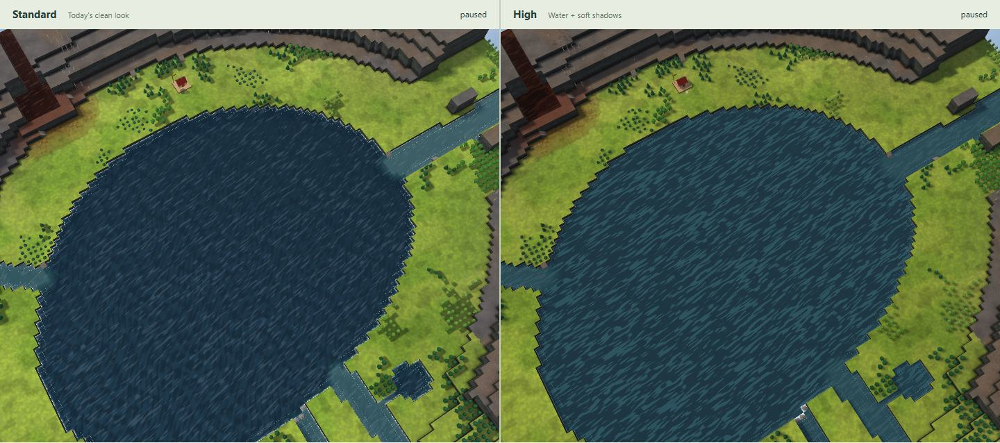
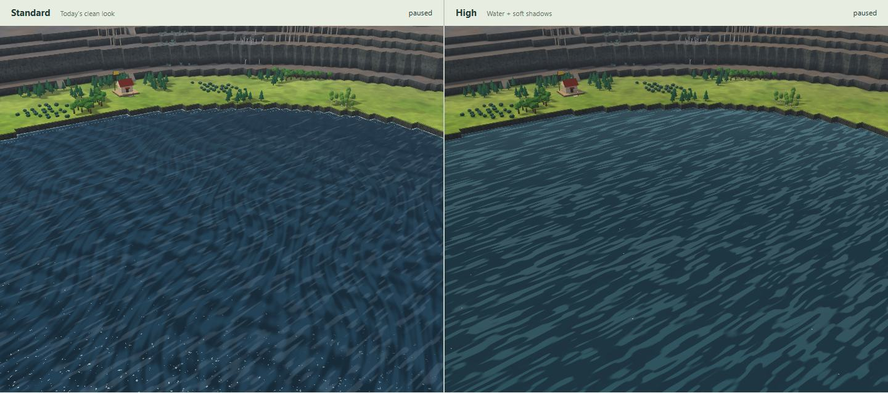

# Map look 2: water and shadows

Working prototype from dev `692dd72`, using three.js 0.186.0. Only this directory changes. Grass, dirt, contamination patterns and models are the existing clean look.

Run from the repository root:

```sh
npm --prefix investigation/maplook2 run demo
```

Use Node 22.12+ and open http://127.0.0.1:4197. First run installs this folder's locked dependencies. Choose a map, drag either view, and switch Water or Soft shadows separately. Sun turn demonstrates live shadow movement; Reset sun restores the comparison. FPS measures the combined workload of both views. Judge speed on your PC.

## Result and captures

Standard is on the left, High on the right; cameras and water time match. Clean High water now follows Kyler's measured colours: a restrained blue-grey body, gentle depth darkening, drifting lighter streaks, sparse near-white flecks, and lighter reflections toward the horizon. Real bed detail transmits faintly, more in the shallows. Badwater, waterfall foam and the accepted soft shadows keep their previous shader paths.

**Measured-colour revision:** this replaces the previous bright teal treatment. The colour constants compensate for the demo's lighting, warm finish and visible bed; simply entering the screenshot hex values as material inputs did not produce those colours on screen. No screenshot or game asset was loaded: only the supplied numeric measurements were used.






The **Look at** menu now includes Water · from above, low angle and grazing angle. Also see [grazing](captures/lake-128-water-grazing.jpg), [second lake from above](captures/lake-256-water-above.jpg), [the start](captures/river-128-start.jpg) and [badwater meeting clean water](captures/river-256-meeting.jpg).

More comparisons: [badwater](captures/river-128-badwater.jpg), [wet/dry contaminated soil](captures/river-128-soil.jpg), [ruins](captures/river-128-ruins.jpg), [another angle](captures/river-128-start-angle.jpg), [256² overview](captures/river-256-overview.jpg), [shoreline](captures/lake-128-shore.jpg), [low angle](captures/lake-128-shore-low.jpg), [Real Victoria Falls](captures/real-victoria-falls.jpg), [Real Yosemite](captures/real-yosemite-cliff.jpg), [M9 Canyon](captures/m9-canyon-falls.jpg), [M9 River Valley](captures/m9-river-start.jpg), [water only](captures/water-only.jpg), [shadows only](captures/shadows-only.jpg), [demo controls](captures/demo.jpg).

Readability sheets include greyscale and three colour-vision simulations: [start](captures/river-128-start-readability.jpg), [soil](captures/river-128-soil-readability.jpg), [mixed water](captures/river-256-meeting-readability.jpg). The ground and start retain their established cues. Water reads through moving streaks, faint transmission and foam; badwater keeps its darker brown ribbons. Very distant dry contaminated veins remain subtle, as in Standard.

## Rendered colour check

The final framebuffer is measured after lighting, haze, the existing finish and alpha blending over the actual terrain shader. Body samples average the lower-middle brightness band; streak samples average the 96th–98.5th percentile, excluding sparse glints. These are measured results, not a table of material inputs.

| Water sample | Target | Rendered, rounded RGB |
|---|---|---|
| Deep, above | #1D323E | #1D323E |
| Body, above | #24434D | #24434D |
| Shallow over bed | #2A4B55 | #2A4B55 |
| Streaks, above | #2F545F | #2F545F |
| Streaks, low | #3A5761 | #3A5761 |
| Body, grazing | #34505A | #34505A |
| Streaks, grazing | #507B81 | #507B81 |

[Measurements and preservation checks](captures/colour-check.json). Since the screenshots did not specify numeric depths or angles, the reference depths are 0.25, 1.25 and 4.25 levels, viewed at 70°, 30° and 10.3° above the surface. The test uses a 64² synthetic bed, the same renderer/sun/shadows, time 8 s and a central 120×48-pixel patch. Actual maps interpolate between these anchors and vary with shadow, bed, angle and texture. This is not a claim that every water pixel equals a swatch.

`npm --prefix investigation/maplook2 run check:colour` repeats the measurement with the demo running and Chrome installed. It permits at most two RGB code values of error; this software run rounds to all seven targets exactly. It also compares against the preceding accepted shader from commit `1919106`: pure badwater is unchanged across 1,283,415 channels, and the waterfall curtain across 18,720 channels. Foam colour, coverage, motion and opacity formulas remain unchanged.

## Checks

TypeScript and the production compilation pass. Headless Chrome/SwiftShader loaded **25 maps**: seed 4242 in all six themes at 128² and 256², three Real places, and all ten M9 files present. No page/shader errors. Both toggles produce distinct results; turning the sun changes High only; water animation changes High; dragging High synchronizes Standard. With both effects disabled, **all 1,711,220 pixel channels match Standard exactly**.

The water revision passed this sweep again. The shadows-only pixel hash is unchanged (`2597898124`), and its JPEG is byte-identical to the accepted revision. The shadow code is unchanged too.

[Verification](captures/verification.json) records the renderer, map counts, camera poses, checks and visible water/soil sample tiles (pixel positions relative to High's canvas). These are evidence of execution and appearance, **not GPU performance measurements**. Captures use 1440×940, DPR 1, water time 8 s, JPEG 75–76; colours are checked in uncompressed pixels, not JPEGs. No game assets or game screenshots.

Reproduce with the demo running and Chrome installed: `npm --prefix investigation/maplook2 run capture`, then `node investigation/maplook2/readability.mjs`. `npm --prefix investigation/maplook2 run check` and `run build` check the code. The build is a compilation check; map discovery is served by the local demo server.

## Decisions

- Standard imports today's renderer and materials. A demo-only Vite transform disables automatic Light selection so software captures compare Standard with High. No source file is edited.
- High changes only water and sun shadows. Terrain patterns, soil/contamination, models, sky, grading and resolution remain the baseline. Existing contact darkening stays; no new AO pass.
- Generated maps use the repository generator in a worker; Real places use its library/build path; M9 files use its importer. No game assets or game captures are read or copied.
- The original checkout has unrelated edits. Work uses a separate worktree from dev and the explicitly authorized branch.
- Clean-water sky reflection uses a calibrated angular colour envelope, not reflected terrain. Foam uses existing tile flags; no physical flow is invented. The 2048² map-wide shadow softens small objects on large maps. None of the 25 maps has cave columns, so cave support remains a proposal, not a tested claim. See [INTEGRATION.md](INTEGRATION.md) for adoption, automatic High/fallback, M9/caves and likely costs.

## Steps

1. Read CLAUDE.md, PLAN §20 (D114, D147, D154), the clean-look notes/captures and src/render3d. Set up the isolated runner.
2. Built the worker-backed comparison and both effects. Initial SwiftShader images exposed self-shadow stripes; receiver-plane PCF correction removed them.
3. Kept badwater visibly liquid from above, captured all required meanings and angles, and passed the 25-map sweep plus parity/toggle/animation/camera checks. Added the integration proposals. Updated the unused local dev reference for the requested scope check; dev advanced only in planning documents during this work.
4. Revised only High water after the PC feedback: raised teal-blue saturation and brightness, retained clear banks, strengthened moving ripple/sky highlights and waterfall foam. Kept the shadow implementation byte-for-byte unchanged. Refreshed the comparison set, including the requested start, waterfall and 256² overview.
5. Replaced bright clean water with the supplied measured palette. Calibrated the displayed output, added above/low/grazing views and numeric/preservation checks, and refreshed the captures. Kept badwater, waterfall foam and soft shadows as accepted.
