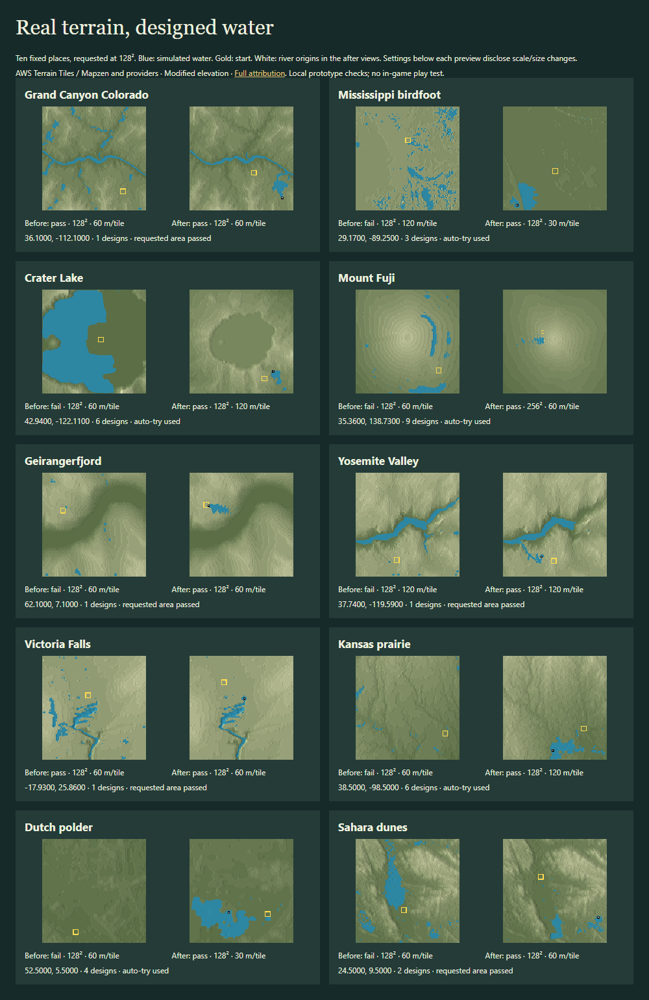

> Historical PR #34 result at commit 474724a. This is the before comparison, not the current algorithm. See REPORT.md for this follow-up.

# Pick a place: designed water

The land is real; the water is designed. AWS Terrarium still works directly in the browser worker, so **no proxy is needed**. [Sources and browser tests](SOURCES.md).

The same 50 places × 3 requested sizes now yield **76/150 (50.7%)** passing requested areas with up to two water designs, across **40/50 places**. With automatic retries: **142/150 (94.7%)**, across **50/50 places**. Before: **47/150 and 30/50**. One source design alone passes 61/150. [Unchanged baseline](BASELINE.md).

| Requested size | Before | First design | Requested area, ≤2 designs | With auto-try | Total median / p90 / max | Median paired time added |
|---|---|---|---|---|---|---|
| 96² | 10/50 | 20/50 | 25/50 | 47/50 | 3.17 / 28.97 / 48.74 s | 0.98 s |
| 128² | 17/50 | 22/50 | 29/50 | 48/50 | 3.22 / 25.48 / 61.26 s | 1.02 s |
| 256² | 20/50 | 19/50 | 22/50 | 47/50 | 22.73 / 93.09 / 122.69 s | 13.66 s |

These are local checks, not in-game play tests. The before/after comparison includes the stricter dry-path check, head-origin audit, new scale screening and source planning; it is not a water-placement-only ablation. Paired time differences include network/cache variation on the same host. The original results remain in results/; the new results are in results-water/.

**Water design.** Score real drainage for nearby flat banks, confined valleys, downhill length, cliffs and natural basins. Place springs below ridges or at valley heads so their routes cross interesting ground. A flat place still gets a designed boundary entry. There is no native-river or positive-elevation requirement. Use up to 1/1/3 distinct tributary heads at 96/128/256, spaced a quarter-map apart; the alternate uses one head. First-design strength per source is 3 × sqrt(size/128); the alternate head uses 1.8 × sqrt(size/128). The optional cliff/basin intention changes routing weights; it cannot guarantee a waterfall or lake. Canonical simulation decides where water actually goes.

**Source origins.** Game sources begin at an exact map-edge river entry or a tributary head below a ridge, never mid-river or on a lake/basin floor. More flow changes head strength; there are no downstream boosters. Prefill rejects a head on another river route. Before accepting a multi-head map, simulate all other heads with each head turned off: it must stay dry. Every passing result includes this local origin audit.

**Start.** Keep a dry existing 3×3 pad and ring. Rank starts by a clean pumpable shore within 20 walking tiles, using exported natural slopes and blocking flooded ground. Place resources from simulated moisture. Download only passes. No terrain cell is edited after mapping: no cut channels, flattened pads, rims or walls.

**Auto-try.** After two unsuccessful water designs, try the other two scales, other two sizes, then two measured offsets. Stop at the first passing design in this bounded order; this is the best passing result tested, not a global optimum. Return its actual size, coordinates and scale visibly. If all fail, show the best failed terrain and two nearby simulated previews with reasons, without a download. All 558 source-design attempts are recorded. 12 passing requests change size; 4 shift coordinates.

**Evidence.** 150/150 selected files pass write/read/load checks; 0 request-level runtime errors. Remaining failures (overlap): water.settles 1, start.water.D153 4, water.source_origins 3. Passing a desert means the designed opening works, not that a real river exists. The Pacific control recasts real bathymetry as game land; a pass does not reconstruct the ocean surface or real coastlines. Constant ocean, ice and provider seams can still be poor terrain. Source seam detection and polar coverage remain limitations.

[All 150 renders](results-water/gallery.html) · [Machine-readable summary](results-water/summary.json) · [Passing example files](examples-water/) · [Algorithm and reproduction](METHODS.md) · [Integration proposal and deletion plan](INTEGRATION.md).

The milestone run still owns shared D153 and no-wall validation. This run uses the explicitly labelled LOCAL D151–D153 adapter against core 84b1866; origin/dev bf4e612 still had the old validator when checked. It retains the old Normal 40-living-tree gate pending shared D164. No shared validator was changed. No game was launched; no site or proxy was published.
