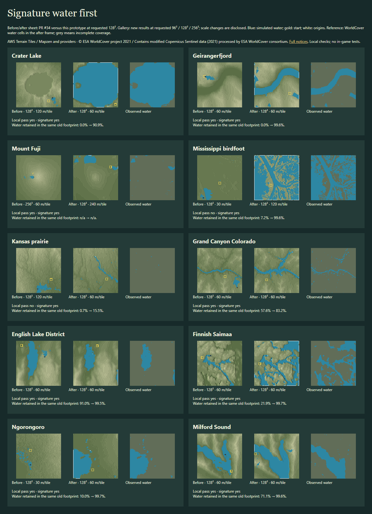

# Pick a place: signature water first

Water now defines the place before the start is chosen. The browser worker uses AWS Terrarium elevation plus ESA WorldCover's open 2021 water classification. Terrain remains browser-direct; **WorldCover needs the small fixed-dataset range proxy** tested locally here. Nothing was deployed. [Data and attribution](ATTRIBUTION.md).

Across the same 50 places × 3 sizes, **103/150** pass local playability and **148/150** preserve their signature target. **102/150 (68.0%) pass both**, across **43/50 places**; only those get downloads. The previous water prototype passed **142/150 across 50/50**, but did not require its water feature to survive. These are different acceptance gates, reported separately.

| Requested size | Previous local pass | New local pass | Signature present | Both | Median / p90 / max time | Median paired time added |
|---|---|---|---|---|---|---|
| 96² | 47/50 | 39/50 | 49/50 | 38/50 | 5.76 / 27.81 / 47.44 s | 0.43 s |
| 128² | 48/50 | 34/50 | 50/50 | 34/50 | 8.62 / 46.99 / 129.75 s | 3.69 s |
| 256² | 47/50 | 30/50 | 49/50 | 30/50 | 58.92 / 467.57 / 900.08 s | 31.36 s |

**Named places.** Crater Lake passes 3/3 sizes, Geirangerfjord 2/3, Mount Fuji 3/3, Mississippi birdfoot 0/3 and Kansas prairie 0/3. Mississippi and Kansas remain unresolved: their water features appear in the previews, but the former fails resources and the latter fails settling. Kansas now has a watercourse across the terrain; it is not a passing download. The passing [96² Crater Lake alternative](examples-signature/13-96.timber) keeps the whole lake inside the frame with one basin spring.

**Measured preservation.** In 121 completed comparisons with measurable classified water, mean retained water in the **same previous map footprint** changes from **31.3% to 77.2%**. Observed signature features present: **12 → 92** in those cases. These averages include failed previews; only accepted maps have passed the full origin and playability checks. Water outside the new crop counts as lost. Using a one-percentage-point threshold, 101 cases improve and 13 regress; changes of framing can still lose water from the previous extent even when the current target passes. Within returned frames, mean retention is 86.0%; mean water precision is 42.9%, showing extra game water (including coarse-cell widening) as well as retained real water. The classification misses some narrow/seasonal channels and is not a current survey. Unknown or absent reference water is n/a, never 100%. [Every place and size](MEASUREMENTS.md).

**Design.** Lakes begin at one spring inside each independent basin. Fjords, coasts and clipped lakes use sources along their open boundary; rivers enter at upstream mouths, with adjacent head sources rather than downstream boosters. Lake inflow scales with area and evaporation; river inflow scales with inlet width. Minor mask fragments are not treated as signature lakes. Prefill removes likely boosters; accepted maps also pass the local canonical whole-head audit with every interior origin dry when its own head is off.

Elevation often records a lake's surface, not its bed. The prototype infers one or two levels of underwater depth only inside observed water cells. It never raises walls or rims or edits land outside those cells. This bathymetry is designed, not measured. Start screening begins from the main water body's actual connected shore, then checks the walk and resources. A dry-land route is designed only when no usable observed feature exists.

**Search.** Try the same centre and requested size at 60, 120, 240 and 30 m/tile; test normal inflow, stronger head inflow, then gentler height mapping. Preserve the initial frame's observed features when changing scale. A small opening pond cannot replace a signature feature. This round deliberately keeps size and centre fixed; future wider search must keep feature identity too.

**Limits.** 149/150 exports pass reload checks; 1 request error (1 timeout). The benchmark applies a 15-minute deadline to each worker request; timed-out results have unmeasured water and count as failures. Their elapsed times are lower bounds. 6 returned frames lack full reference coverage. Remaining checks (overlap): water.source_origins 7, water.settles 31, resources.scrap 8, resources.trees 6, start.water.D153 4, start.signature 6, signature 1. Flooding, coarse channels, incomplete references and resource shortages remain visible failures; the known Taveuni elevation-tile seam also remains. The prototype does not dry the place to pass. No in-game test was run. The explicitly local D153 adapter and old resource checks remain temporary; [INTEGRATION.md](INTEGRATION.md) lists what the milestone replaces.

[All 150 outcomes](results-signature/gallery.html) · [Passing maps](examples-signature/) · [Methods](METHODS.md) · [Machine-readable results](results-signature/summary.json).
