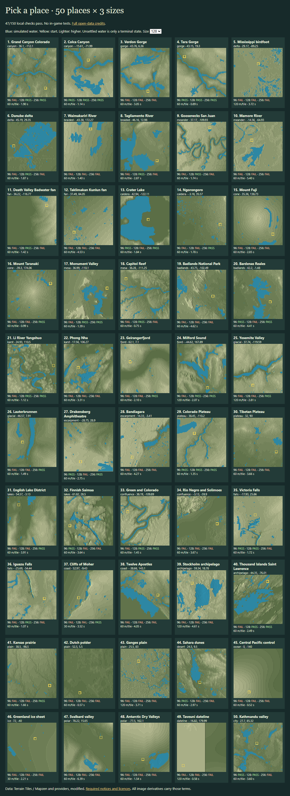

# Pick a place

**Use AWS Terrain Tiles (Terrarium), directly from the browser. No proxy is needed.** Coordinates → automatic scale and height mapping → existing conversion pipeline in a browser worker → checked .timber download works. This is a research prototype, not a promise that every place is playable.

## What ran

50 varied places × 96², 128² and 256²: **47/150 (31.3%) passed the labelled local checks**. **30/50 places** passed at one or more sizes. The unchanged base validator passed 27/150. Every failure is retained. “Converts well” here means those checks pass; visual appeal and in-game play remain unverified.

| Size | Passes | Total median | Total p90 |
| --- | ---: | ---: | ---: |
| 96² | 10/50 | 2.25 s | 3.72 s |
| 128² | 17/50 | 2.10 s | 4.41 s |
| 256² | 20/50 | 7.81 s | 16.47 s |

These are Edge worker measurements on one Ryzen 7 9800X3D machine, including fetching, analysis, simulation and export/reload. Later sizes reuse cached tiles. 150/150 exported files passed reload/load checks; 0 runtime errors. The page timer continued during every completed conversion. [Full results and failures](RESULTS.md), [all small renders](results/gallery.html), [sample maps](examples/README.md).

## What the prototype chooses

Sample three cheap previews at 30, 60 and 120 metres per tile. Choose using relief, slopes, low-ground share and inferred drainage. Compare normalised height mappings with up to 16 terrain levels. Keep some flat building space; avoid turning centimetres of noise into mountains. Preserve every mapped terrain cell: **no walls, rims, channel cuts or start pads**. Add inferred water sources, natural slopes and resources through the landscape pipeline. [Method and reproduction](METHODS.md).

This gives useful canyons and some volcano/fjord maps, but shape alone cannot predict a working start or water settling. Only **45/131 “promising” predictions** passed. The score is a screening aid, not a success probability. Suggestions name larger/finer areas or measured nearby drainage coordinates; none claims a confirmed river. Water masks and a short simulation preview are the next investigations.

## Data and limits

Real browser probes: Terrarium worked; USGS 3DEP returned readable byte ranges; the tested Copernicus and Open Topo Data endpoints were blocked by CORS. The Terrarium EU mirror returned 403. [Resolution, coverage, licences, attribution, quotas, timings and optional proxy cost](SOURCES.md).

DEM resolution does not establish river depth, real discharge or whether low ground is water. A dateline control also exposed an upstream zero-tile seam, verified with an independent decoder. This prototype covers 85°S–85°N; polar coverage needs another projection/source route. Ocean and ice controls remain failures where they cannot meet the start rules. The sample is selected for variety, not a world-wide success estimate. Timberborn was not launched.

## Decisions

Use the existing pipeline and Normal start settings. Keep complete provider notices in the page and each map. Use only open elevation. Keep integration as a proposal after Live editing; no production files or deployment changed.

**Temporary checks are explicitly local.** The milestone run owns D153 and the no-wall validators. [INTEGRATION.md](INTEGRATION.md) lists which adapters to delete when that lands, and requires rerunning this matrix against the shared implementation. These results retain the base tree-count gate pending D164's shared wood thresholds. Base: 84b1866b4e1d444346949a7dd57dc0f3f9f69ac5.
