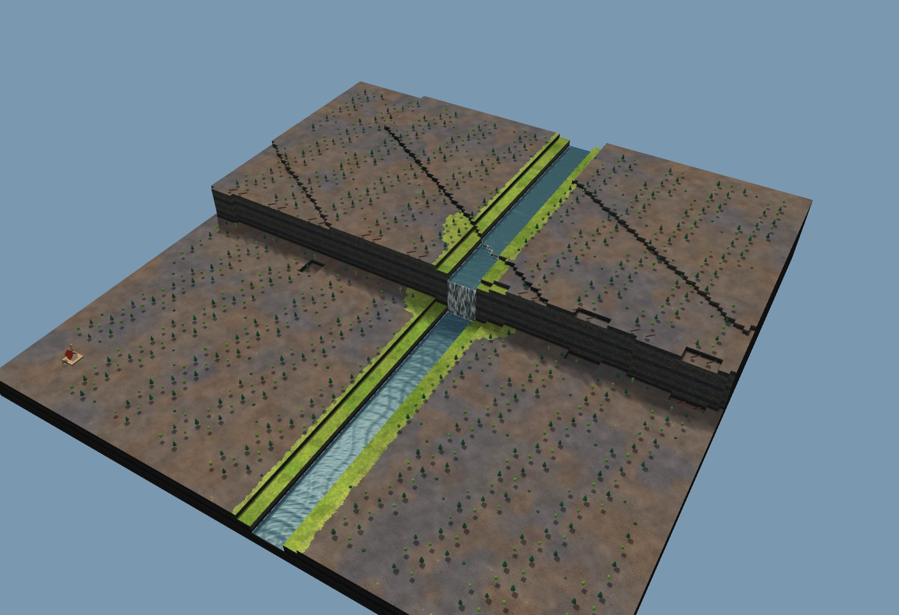
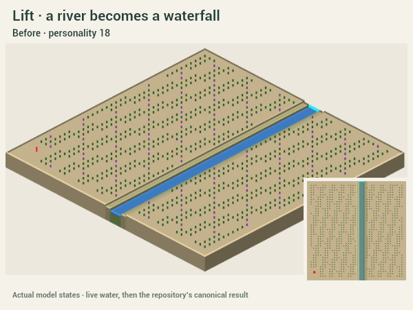
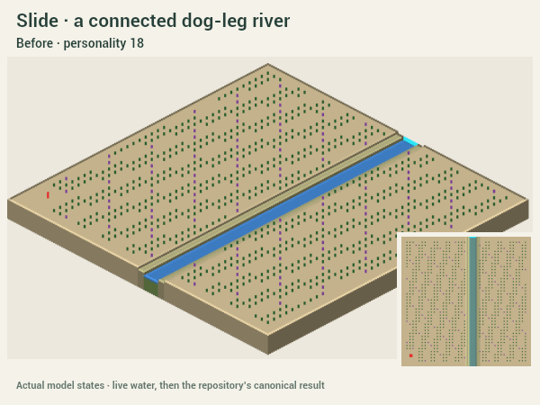
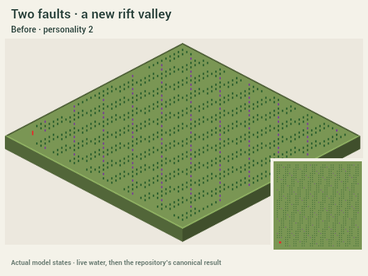
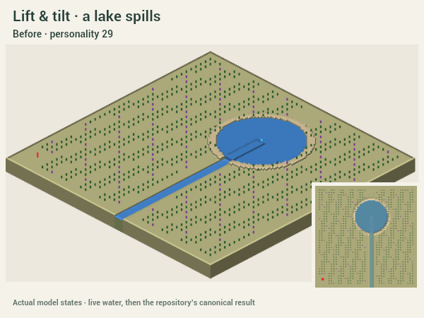

# Quake

Draw a fault. Click the side to move. The land tears, objects ride with it, and existing water finds a new way through.

```sh
npm --prefix investigation/quake run demo
```

The launcher installs its own dependencies and prints a free local port. The picker includes generated 128² and 256² seeds, three Real places, and clearly labelled process studies. Drag a bending fault, or click then Shift-click for a straight one. Pick **Lift / Slide**, **Power**, and **Sheer / Stepped**. **Try another** changes the saved seed from the original ground.

**Esc or Undo restores the entire quake**, including objects and water, even during settling. Saved quakes replay their stored result exactly. Right-drag orbits, middle-drag pans, scroll zooms, and WASD moves. Camera follow and shake are optional. Reduced motion disables the effects and camera motion.

## Captures

The clean 3D demo, captured directly from its WebGL canvas:



These short sequences record actual model fronts and live WaterSim states. Their last frame uses canonical water. They use Carve's CPU capture renderer; the browser above shows the clean renderer and effects. Each GIF has a same-name PNG for reduced motion. [Settings and seeds](captures/scenarios.json).







## Checks

```sh
npm --prefix investigation/quake test
npm --prefix investigation/quake run typecheck
npm --prefix investigation/quake run build
npm --prefix investigation/quake run captures
```

All pass. [Model checks](captures/checks.json) cover whole levels, deterministic seeds/slices, unchanged inputs, buildable blocks, fault refusal, moving starts, object transport, edge continuity, rifts/ridges, scarps, dry ground, live waterfalls/lake spill, and exact or rejected replay. [Actual worker checks](captures/worker-checks.json) cover cancellation during planning, meshing and settling, one-step undo/redo, alternate personalities, and portable saved results. [All picker maps](captures/map-checks.json) pass both movement modes.

Browser checks covered drag, click/Shift-click, the red start refusal, side selection, clean waterfalls, undo, and the 256² view. The [256² capture](captures/browser-256.json) measured **149 ms to changed terrain, a 1.16 s rupture, and 8.1 ms p95 frame time during the event**. These are measurements on this PC, not a frame-rate guarantee for every device. Generation can take several seconds in the worker; quake interaction remains separate. No Timberborn process was launched.

## Decisions and limits

- Started from dev `08039c5` in an isolated checkout; unrelated workspace work stays intact. All authored files stay here. The requested scope takes precedence over root-document/contact-sheet rules. No generator theme changed.
- Read Carve at `b14e23f` and Craterize's available local implementation based on `62a8b97`. Craterize was still being built and had no remote branch at task start. Reused their worker/cancellation pattern, clean shell and meshes, fixed effects pool, frozen geology, fallen-tree state and literal-result operation. No PR was reviewed.
- Long blocks continue to the edge; an early test caught an artificial upstream dam caused by fading displacement too soon. Short faults fade past their ends. Slide fills exposed edge terrain by nearest-ground continuation and resolves object collisions near their moved anchors.
- Terrain is always whole levels, bounded by the map limit and 22. The start keeps its footprint and entrance apron. Canonical water that would flood it causes the whole event to revert. Resource reach remains a quiet consequence check.
- Quake creates no source and does not prefill live water. The final water is the repository's canonical result. Source-free puddles can disappear at that handover. Fallen trees have a saved demo pose; production project/export support is an integration proposal.
- This is a terrain force, not a tectonic-physics model. History keeps render caches and literal water checkpoints in memory. [INTEGRATION.md](INTEGRATION.md) proposes one shared forces core and its production memory budget.

Steps were committed separately: foundation, model, live demo, then captures and validation. Large builds, dependencies and working captures are ignored. [A small saved quake](samples/tiny-quake.json) exercises portable replay.
