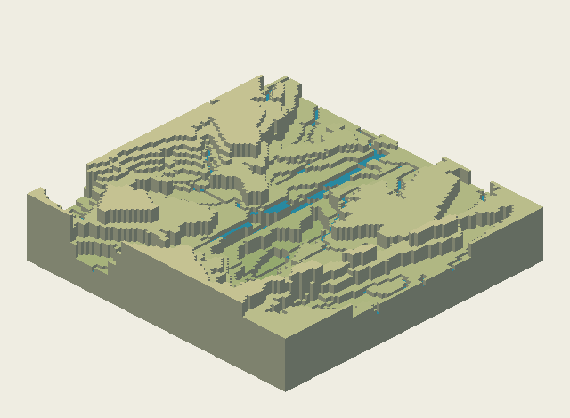
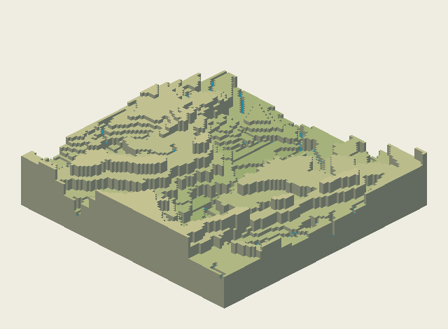
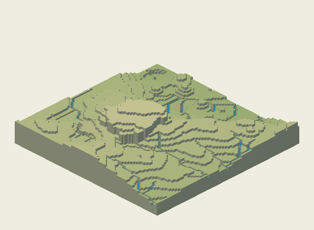
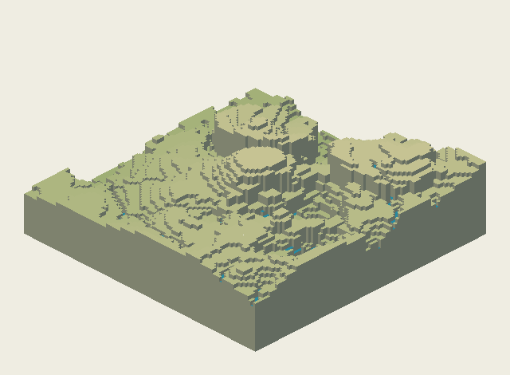

# Investigation report

2026-09-25. **Outcome: a cited playbook, integration proposals, and two reproducible terrain experiments.** The experiments expose tradeoffs; they do not establish playable maps or justify replacing M9's current processes.

Start with [PLAYBOOK.md](PLAYBOOK.md). [INTEGRATION.md](INTEGRATION.md) contains proposals only. [SOURCES.md](SOURCES.md) records provenance and access limits. [Prototype instructions](proto/README.md) reproduce all results and renders.

## Decisions made without waiting

- Work starts from `dev` at `948f395137a6725d4b726864a47e6966d7f2f09a` on `investigation/techniques`. Only `investigation/techniques/` is changed.
- The initial workspace was an empty Git repository. Fetching `dev` supplied the requested repository. Its `CLAUDE.md`, product principles and FORMAT were read.
- `docs/m9-design.md` and `investigation/generative/proto/` were absent from that `dev`. They were read from `investigation/generative` at `a5f189d3e96affec533415090bdb8f09d606c8fd`, without merging or reviewing a PR. The prototype reads those pinned Git objects into an ignored cache inside this directory.
- M9 already supplies erosion and drainage. The two most promising additions to test were independent spatial controls and contour/channel-aware quantization. These address variety and low vertical resolution without taking on a new water solver.
- The available M9 implementation caps height at 16. For the requested 22-level study, the baseline stretches its integer output, while the experimental quantizer works from continuous heights. This is a diagnostic comparator, not an implemented high-Verticality feature or a fair measurement of a future native 22-level M9.
- Use a fixed modest batch: River Valley, Canyon and Highlands; seeds 1–12; 96²; Variety 70; first genome only; caps 16 and 22. This is 72 paired cases, not M9's full acceptance batch. Seed 1 of every theme/cap was chosen for renders before results were inspected. Failed proposals remain visible.
- Generate our own PNGs without external assets. Do not create `.timber` exports from incomplete research fields. No game, mods or saves were opened.
- Treat rare-trait rates, cut limits and future multiplayer tolerances as hypotheses. They are labeled as such rather than borrowed from another game or silently made into product rules.

## Experiment 1: independent spatial controls

Both sides draw the same M9 genome. The baseline uses M9 uplift, erosion and level snapping. The variant adds three separately seeded, broad controls before the unchanged erosion: elevation bias, relief attenuation and ridge/valley bias. Both use the same diagnostic channel-selection rule, though their drainage trees differ because their land differs.

Each diagnostic channel mask selects cells whose four-neighbour catchment area is at least `max(36, area/100)`. Both sides cut these cells one level. This is intentionally cheaper than M9's complete `planHydro`; the baseline is **not** a complete M9 generated map. In particular, uphill counts below must not be read as defects in M9's finished hydrology.

The coarse spread measure is the mean pairwise Euclidean distance over `[cliff-edge share, bench share, fall-edge count/100, flat-pad count/area]` within each 12-seed theme. Its scales are explicit but uncalibrated. It is not rotation-aware M1/M2, nor an opening/strategy metric.

| Theme | 16 baseline → controls | 22 baseline → controls |
|---|---|---|
| River Valley | 0.108 → 0.087 | 0.152 → 0.136 |
| Canyon | 0.170 → 0.175 | 0.186 → 0.170 |
| Highlands | 0.161 → 0.187 | 0.168 → 0.182 |

**Interpretation:** promising for Highlands on this proxy, mixed elsewhere. The added controls change the land but do not automatically widen its useful variety. Test the fields separately, then use M9 opening/cycle measures. Do not adopt these coefficients as defaults.

## Experiment 2: coherent levels and bounded channel repair

The input is experiment 1's controlled, eroded field. A new quantizer uses smooth contour offsets and protects channel cells from tiny-region cleanup. It then cuts downstream cells where a proposed bed would rise along its receiver tree. Each proposed repair has a three-level maximum cut and a total cut volume limit of `0.08 × area`. A proposal exceeding either limit is rejected; there are no retries hiding failures.

The “before repair” row isolates the repair's effects within the new quantizer. “Controls” retains the original M9 quantizer (stretched at 22). Therefore the controls-to-proposal comparison also changes terracing/cleanup; it does not isolate channel protection alone.

| Cap / variant | Uphill channel edges, total | Potential fall edges/map, mean | Tiles in tiny regions | Flat pad candidates/map, mean |
|---|---:|---:|---:|---:|
| 16 / controls | 408 | 10.33 | 1.81% | 3,045 |
| 16 / before repair | 2,228 | 13.50 | 3.41% | 2,642 |
| 16 / proposed repair | 0 | 2.08 | 2.12% | 2,639 |
| 22 / controls | 408 | 24.53 | 1.92% | 3,044 |
| 22 / before repair | 2,967 | 27.64 | 5.42% | 1,886 |
| 22 / proposed repair | 0 | 5.00 | 3.82% | 1,884 |

There are 36 cases in every row. The proposed rows include rejected proposals, to show the full repair's effects. The actual acceptance rate is **31/36 (86.1%) at 16** and **17/36 (47.2%) at 22**. These are cut-budget acceptance rates, not playable-map pass rates.

“Tiny” means a four-connected same-level region smaller than six tiles. “Bench” in the JSON means a same-level region of at least 25 tiles. A “pad” is only a flat 3×3 plus same-height Cw0 entrance; overlapping pads are counted. It has no water, resources, air occupancy or reachability guarantee. A fall edge means a bed drop of two or more, not a simulated waterfall.

**Interpretation:** the DAG repair proves non-rising channel beds but often cuts through basin rims and erases drops. The replacement quantizer also fragments terrain more than M9's. Retain M9's quantizer, lake handling and channel-profile logic; investigate narrow protected masks and basin-aware repairs there. Rejecting a costly repair is better than quietly flattening the map.

## Small renders

All surfaces below are generated from this repository's M9 parts and our experiments. Blue marks candidate drainage, not settled water. Green/tan encodes elevation, not fertile soil. No objects or slope routes are present.

Paired Canyon seed 1 at cap 16: M9-based diagnostic baseline, then independent controls. The broad layout changes while the genome's part choices stay fixed.

River Valley seed 1 at cap 16 after constrained levels: accepted repair (48 cells lowered, one level each).

Highlands seed 1 at cap 22: **rejected** proposal. It needs a seven-level maximum cut, exceeding the three-level limit. Its appearance does not override that result.

The [gallery](out/gallery.html) has all 18 paired renders, including rejected proposals. The [case ledger](out/results.json) includes every seed, parameter draw, metric and repair result.

## Verification and limits

- Adversarial checks pass: closed-basin spill, acyclic routing across a flat field, level caps, non-rising proposed beds, and rejecting a deep-bowl repair. The first rejection fixture was too small: percentile fitting clipped its isolated pit without producing an excessive repair. It was corrected to a 3×3 bowl; the implementation and rejection limits were not loosened.
- The batch checks every receiver ordering and level cap. All 72 proposed channel trees have zero uphill bed edges after repair, including the rejected proposals.
- A fresh-process `run.mjs --verify` checks exact metrics and SHA-256 of all terrain outputs and example PNGs against the committed ledger. This tests the current Node/runtime, not cross-browser parity.
- Final terrain/render digest: `b6ac8285e06e5d7a5b151eb1d80edc39e4633b8a3cd5553bfd49666e2dbc87b9`.
- Measured on Node 24.13.0 / Windows: about 235 ms mean, 591 ms maximum per theme/seed group. A group includes two eroded fields, both caps, measurements, and rendering for seed 1. [Timing record](out/timing.json). It excludes initial module loading and does not measure full production generation, water settle or browser performance.
- Representative baseline, controlled and repaired PNGs were visually inspected; framing includes the full terrain. The gallery's captions identify cap, variant and rejection state.
- No canonical water settle, drought/badtide simulation, resource placement, slope placement, voxel carving, full validators or in-game test was run. The start, multiplayer and 3D sections are design proposals. No claims of ≥98% production pass rate, fairness, natural appearance approval or different play follow from this study.
- Reproduction needs the pinned M9 Git object and Node's experimental TypeScript stripping API. No external package installation is needed.

## Publishing boundary

The sole authorized publication is branch `investigation/techniques` and one open PR into `dev`. Before opening it, run `git diff --name-only dev...HEAD` and reject any path outside `investigation/techniques/`. No merge, approval, auto-merge, tag, release, deployment or push to another branch is part of this work.
